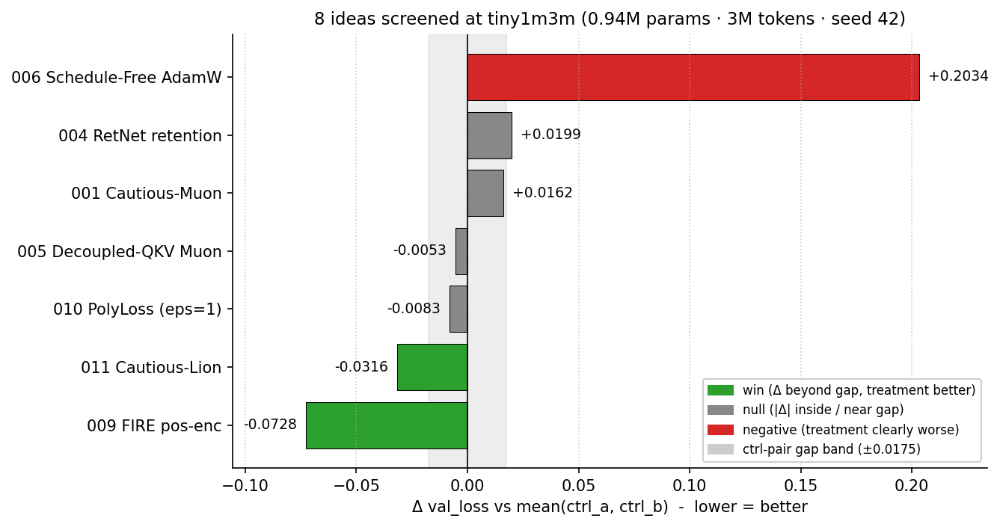

# Screen 8 LLM Training Ideas for $0.20 Before Betting Real GPU Money

Vuk Rosić

We swapped one component (the positional encoding) in a tiny language model and validation loss improved:


Before spending serious GPU money on a training trick, you can test it on a model so small that one experiment costs about two minutes on a cheap rented GPU.

This post walks through how I screened 8 such ideas in one batch, why most of them failed, and why publishing the failures is what makes the wins believable.

## Why 1M Params and 3M Tokens

Most "did this trick help?" claims come from runs nobody can afford to repeat.

A tiny1m3m run is 0.94M params and 3M tokens.

On a single rented Vast.ai 3060, one A/B finishes in about two minutes of wall-clock.

That is the whole point.

```text
tier:     tiny1m3m
params:   ~0.94M (12 layers · d_model 64 · 4 heads · 2 kv-heads · seq 2048)
tokens:   3,000,000 train
seed:     42 (one, fixed)
hardware: 1× RTX 3060 (sm_86, 12 GB) on Vast
budget:   ~2 min per run
```

Effects at this scale are *not* effects at 7B scale.

But effects at this scale do filter out tricks that are *only* alive at this scale and never make it past their own noise band.

A trick that cannot clear noise at 1M params is not free - it costs you a slot on the bigger box later.

## Why One Seed Instead of a Seed Sweep

Pick one of the following.

```text
A) 3 seeds × N ideas, full mean ± std    →  3× the GPU
B) 1 seed × N ideas, two controls run
   back-to-back as a variance bracket    →  1× the GPU
```

Variance does not vanish under (B). It moves into the **ctrl-pair gap**.

You take seed 42 for the treatment.

Then you take seed 42 for the control, run it twice back-to-back, and call `|ctrl_a − ctrl_b|` your within-session noise band.

A treatment "wins" only if `|treatment − mean(ctrl)|` exceeds that gap.

It is a real bracket. It is not as tight as a multi-seed CI. But it is honest about what one rented GPU can pay for, and it actually runs.

```text
within-session noise band  =  |ctrl_a − ctrl_b|
win                        =  treatment beats BOTH ctrls by more than the band
null                       =  delta sits inside (or near) the band
clear negative             =  treatment is many bands the wrong way
```

For this batch the gap was **0.0175** val_loss in the FIRE session and **0.0009** in the cautious-Lion session.

## Why Publish the Nulls

A screen that only ever publishes the wins is not a screen.

It is a leaderboard with the failures filed away in a drawer.

If you only read "FIRE works," you cannot tell whether I tested one idea or one hundred.

When the four nulls and the one negative ride along, you can do the count yourself: 8 ideas in, 2 over the noise band. That is the number that lets you weight the wins.

## The 8 Ideas, In One Line Each

```text
009 FIRE pos-enc           - learnable bias on attn logits over a fixed
                             distance-decay kernel; drop-in for RoPE
011 Cautious-Lion          - sign-mask Lion: zero updates where sign(update)
                             disagrees with sign(grad); rescale by 1/mask.mean
005 Decoupled-QKV Muon     - split fused qkvo proj into 4 matrices so Muon
                             orthogonalizes each with its own spectral scale
010 PolyLoss (eps=1)       - CE + 1.0·(1−p_t); the next Taylor term of
                             the log-likelihood truncation
001 Cautious-Muon          - same sign-mask trick, applied to Muon's
                             orthogonalized update instead of Lion's
004 RetNet retention       - replace softmax attention with a per-head
                             learnable-decay retention kernel (linear-attn)
006 Schedule-Free AdamW    - AdamW with no LR schedule; 3-point iterate
                             averaging instead of warmup/decay
```

The eighth slot is the **control bracket** itself - two back-to-back baseline runs that define the noise band. Without it there is no variance reference and no honest call on the other seven.

## The Results

2 wins, 4 nulls, 1 clear negative. Treatments and controls were run on the same physical box in the same session; the gap column is `|ctrl_a − ctrl_b|` for that session.



The nulls and the negative are in the same chart on purpose. They are what makes the screen credible.

```text
                            treatment   ctrl_a   ctrl_b   Δ vs mean   gap     verdict
009 FIRE pos-enc            6.3234      6.3875   6.4050   −0.0728    0.0175   WIN
011 Cautious-Lion           6.3941      6.4253   6.4262   −0.0316    0.0009   WIN
005 Decoupled-QKV Muon      6.3909      6.3875   6.4050   −0.0053    0.0175   NULL
010 PolyLoss (eps=1)        6.5938      6.5991   6.6050   −0.0083    0.0059   NULL
001 Cautious-Muon           6.4125      6.3875   6.4050   +0.0162    0.0175   NULL
004 RetNet retention        6.4162      6.3875   6.4050   +0.0199    0.0175   NULL
006 Schedule-Free AdamW     6.8056      6.5953   6.6091   +0.2034    0.0138   CLEAR NEG
```

Two notes a careful reader should know about the table.

First, each row is compared against the ctrl bracket from its own session - the PolyLoss, Schedule-Free and Cautious-Lion rows come from later sessions than the FIRE / Cautious-Muon / RetNet / Decoupled-QKV rows, and the later baselines drifted by about +0.19 val_loss - almost certainly because the runner scp'd the live working-tree (with every in-flight idea's uncommitted edits) onto the box. Within-session A/Bs are still valid. Cross-day absolute numbers are not.

Second, "noise band" here is `|ctrl_a − ctrl_b|` - a single number per session, not a confidence interval. It is a much weaker statistical claim than a t-test on multi-seed runs. It is what one rented GPU can pay for, and the calibration is "this is the gap your delta has to clear before I will look at it."

## The Headline: FIRE Positional Encoding

FIRE is a positional encoding from Li et al., NeurIPS 2023 (arXiv:2306.02613).

It replaces RoPE's pure-rotation scheme with an **additive bias on attention logits**:

```text
bias(i, j)  =  γ(i − j) · f( φ(x_i), φ(x_j) )
```

```text
γ        fixed monotone-decay kernel over relative distance
φ        small learned projection of the token embedding
f        small MLP - content-dependent
```

So the position kernel is fixed (preserves the no-max-len property of relative PE) but the *content* of the surrounding tokens can re-weight that bias.

That is the bet: certain tokens (paragraph breaks, function words, code delimiters) should change the effective distance the model sees, and a pure rotation cannot express that.

Concretely, swapping RoPE for FIRE at the same parameter count drops val_loss from ~6.40 to **6.32** (the curve at the top of this post).

The two controls (gray solid, gray dashed) sit right on top of each other for the whole run.

The FIRE curve (green) is *not* visibly separated through most of training - the gap opens up in the last third.

That matters. If your screening protocol checked early-step loss and stopped, you would have called this a null. The decision rule is the **final** val_loss versus the within-session ctrl bracket, and only that.

```text
final step:  step ≈ 732   (3M tokens / (B=2 · T=2048))
final val:   FIRE  6.3234
             ctrl  6.3875
             ctrl2 6.4050
gap:         0.0175
Δ vs mean:   -0.0729   →  4.2× the gap
```

The paper's other headline upside - length extrapolation - is not tested here. Tiny1m3m is fixed-length (T=2048). Whether FIRE keeps its win at longer context is the next experiment, not this one.

## The Second Win: Cautious-Lion

Lion's update is already `sign(β₁·m + (1−β₁)·g)` - a sign.

The Cautious trick (Liang et al., 2024, arXiv:2411.16085) zeros the update where the sign disagrees with the current gradient, then rescales so the effective LR holds:

```text
mask    =  (update * g > 0).float()
update  =  update * mask
update  =  update / mask.mean().clamp(min=0.1)
```

Drop-in. ~50 LoC on top of bare Lion.

Versus bare Lion as control:

```text
bare Lion         ctrl  6.4253   ctrl2  6.4262   gap 0.0009
Cautious-Lion     treat 6.3941                   Δ vs mean −0.0316
```

The ctrl-pair gap is **0.0009** - bare Lion is reproducible to the fourth decimal here. The treatment's −0.0316 is roughly **35× the gap**.

Comfortable win. Bare Lion ships as a tested optimizer; Cautious-Lion ships with it.

## The Clear Negative: Schedule-Free AdamW

Schedule-Free AdamW (Defazio et al., arXiv:2405.15682) eliminates the LR schedule entirely and replaces it with a 3-point iterate (`x`, `z`, `y = EMA of z`).

The paper won the MLCommons 2024 AlgoPerf Self-Tuning track. At small scale, in this repo, with the current routing, it did not work:

```text
ctrl   6.5953
ctrl2  6.6091
treat  6.8056    Δ vs mean +0.2034
```

`+0.20` val_loss is roughly **15× the noise band**, the wrong sign.

The optimizer was verified bit-for-bit canonical in code review (no first-moment EMA; momentum is emulated via the y/z interpolation). The current `warmup_decay_to_zero` schedule was disabled before the run, as the paper requires.

The result still says: at tiny1m3m, on this codebase, the iterate averaging does not buy back what removing the schedule costs.

That is a real result. It is not a bug to fix. It is the answer.

## The Four Nulls

A null at tiny1m3m says "the effect, if any, is below the noise of one rented 3060 over 3M tokens." It does not say "the idea is wrong at scale."

It does say: I will not spend a 7B-param slot on this until something else proves it out.

```text
005 Decoupled-QKV Muon   Δ −0.0053   gap 0.0175   inside band
010 PolyLoss (eps=1)     Δ −0.0083   gap 0.0059   beats one ctrl by less
                                                  than the gap -> null
001 Cautious-Muon        Δ +0.0162   gap 0.0175   inside band, wrong sign
004 RetNet retention     Δ +0.0199   gap 0.0175   just over band, wrong sign
```

Cautious-Muon is the one that stings most. In a separate same-day sweep (n=3 different control bracket) it cleared the bar. In this single-seed bracket it sat inside the band. A real result in the multi-seed sweep does not retroactively rescue the single-seed null - both numbers stand. The pipeline calls it null on the bracket it ran in.

## What Is Cheap About This Setup

```text
per A/B run:     ~2 minutes on a 3060
per idea (full): ~6 minutes (treatment + 2 controls)
8 ideas:         under one hour of GPU
GPU cost:        about $0.20 for the whole table
```

That is the trade. You give up sharp statistical claims. You get to actually run the screen.

## The Decision Rule, Once More

```text
1. one seed, fixed at 42
2. two controls back-to-back  →  gap = |ctrl_a − ctrl_b|
3. treatment vs both controls
4. WIN          if treatment beats BOTH ctrls by more than the gap
   NULL         if |Δ vs mean| is inside or near the gap
   CLEAR NEG    if treatment is many gaps the wrong direction
5. publish all three categories
```

The point of (5) is that someone reading "FIRE is a +0.07 win at 1M" needs to know I also tested 7 other ideas and ran a baseline twice. Otherwise the headline is a number with no denominator.

## Done Checklist

You are done reading when:

- you can explain why 1 seed + 2 controls is the cheapest honest bracket on rented compute
- you can read the delta-bars chart and tell a null from a real win
- you know the gap rule: `win = beats both ctrls by more than |ctrl_a − ctrl_b|`
- you know which of these 8 ideas earned a slot at the next tier (FIRE, Cautious-Lion) and which did not

Stop here.

---

### Want to get results like this in 1 hours? Schedule 1-on-1 call with me

📆 **$20 (80% OFF) for the founding cohort – first 8 spots.**
→ https://cal.com/vuk-ai/60-min

We can also work on whatever you're stuck on – picking a direction, your first experiment, a paper you can't crack, your training setup, or a career move.

### Not ready for a call? Start free in the Skool

Every experiment I post comes with the scaffolded code and a step-by-step protocol, so you can reproduce it yourself and then run your own variant. You also get the weekly research thread and a community of people doing real AI research.
Free to try.
→ https://www.skool.com/become-ai-researcher-2669/about
