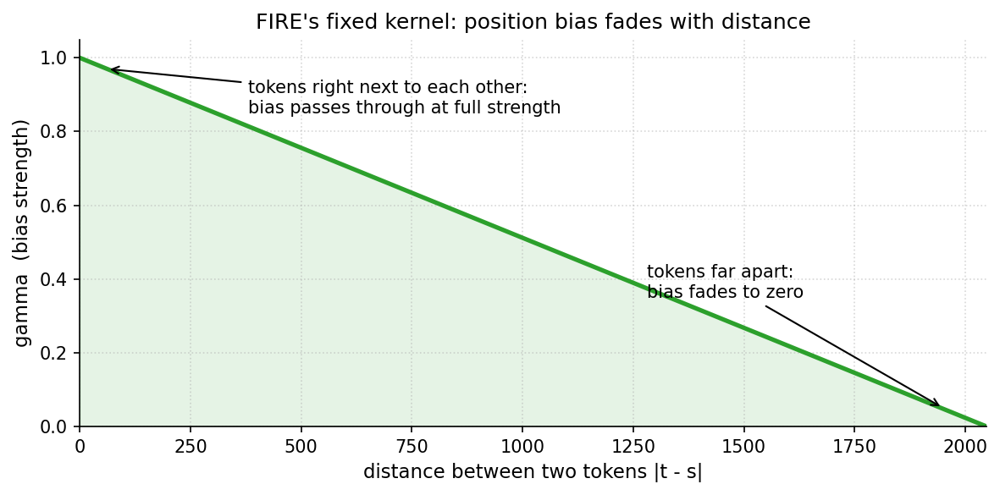
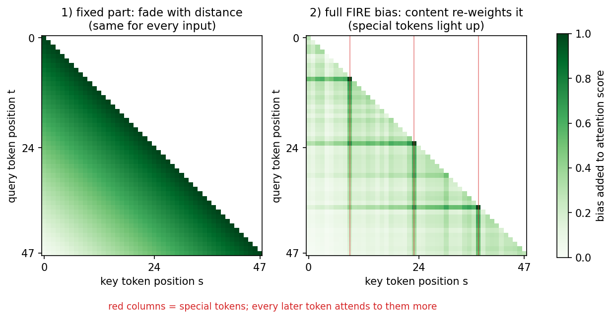

# FIRE Positional Encoding: a Tiny Learned Bias That Improved Our LLM's Loss

Vuk Rosić

We added this trick to a small language model and validation loss improved:


When a language model reads text, every word looks back at all the words before it and decides how much each one matters.

That "how much" is just a number, called an attention score. Bigger score = pay more attention.

But the scores alone don't say anything about *where* a word is. "Dog bites man" and "man bites dog" would look the same.

A positional encoding is the fix: it tells the model where each word sits in the sentence.

Most models hard-code this with a fixed math formula, the same formula for every text, forever.

FIRE teaches it instead: the model adds a small learned number to each attention score and tunes it during training.

Why is learning better than hard-coding? A hard-coded rule treats all words at the same distance equally. A learned rule can discover what your data actually needs.

And there is no downside: if the hard-coded rule was already perfect, the model simply learns to keep it.

## The first concept: bias fades with distance

FIRE starts from one common-sense rule: words close to each other usually matter to each other, words far apart usually matter less.

So the extra number it adds gets weaker the further apart two words are.

That rule is a simple ramp from 1 down to 0.



This ramp is fixed, not learned.

Why keep one part fixed? It guarantees the model behaves sensibly at any distance, even distances it rarely saw during training.

The learning happens on top of this safe default.

## The second concept: some words matter more

The ramp alone treats every word the same. A comma and a paragraph break would fade away equally fast.

But they shouldn't. A paragraph break changes the meaning of everything after it, so even far-away words should still notice it.

FIRE handles this by letting each word raise or lower its own number.

The model learns, from data, which words deserve the boost. Nobody tells it which ones.



Left: the fixed ramp, same for every input.

Right: after learning - a few important words light up as columns, meaning every later word pays extra attention to them.

## It starts as a no-op

The learned part starts at exactly zero.

So at the first training step, the model behaves exactly like a model without FIRE. Nothing changes.

If the extra numbers help, training slowly turns them up. If they don't help, they stay at zero.

That is what makes this safe to try on any model: it cannot make the starting point worse.

## The whole trick in code

It is about 50 lines in a real codebase, and the core is just this:

```python
gamma = (1 - distances / d_max).clamp(min=0)        # fixed ramp [T, T]
score = content_proj(x) @ w                          # learned, starts at zero
bias  = gamma * (score_t[:, :, None] + score_s[:, None, :])

attn_scores = q @ k.transpose(-1, -2) / sqrt(d_k) + bias
```

One fixed ramp, one tiny learned score per word, multiply them, add to the attention scores.

Paper: Li et al., "Functional Interpolation for Relative Position Encoding" (arXiv:2310.04418v2).

---

### Want to get results like this in 1 hours? Schedule 1-on-1 call with me

📆 **$20 (80% OFF) for the founding cohort – first 8 spots.**
→ https://cal.com/vuk-ai/60-min

We can also work on whatever you're stuck on – picking a direction, your first experiment, a paper you can't crack, your training setup, or a career move.

### Not ready for a call? Start free in the Skool

Every experiment I post comes with the scaffolded code and a step-by-step protocol, so you can reproduce it yourself and then run your own variant. You also get the weekly research thread and a community of people doing real AI research.
Free to try.
→ https://www.skool.com/become-ai-researcher-2669/about
