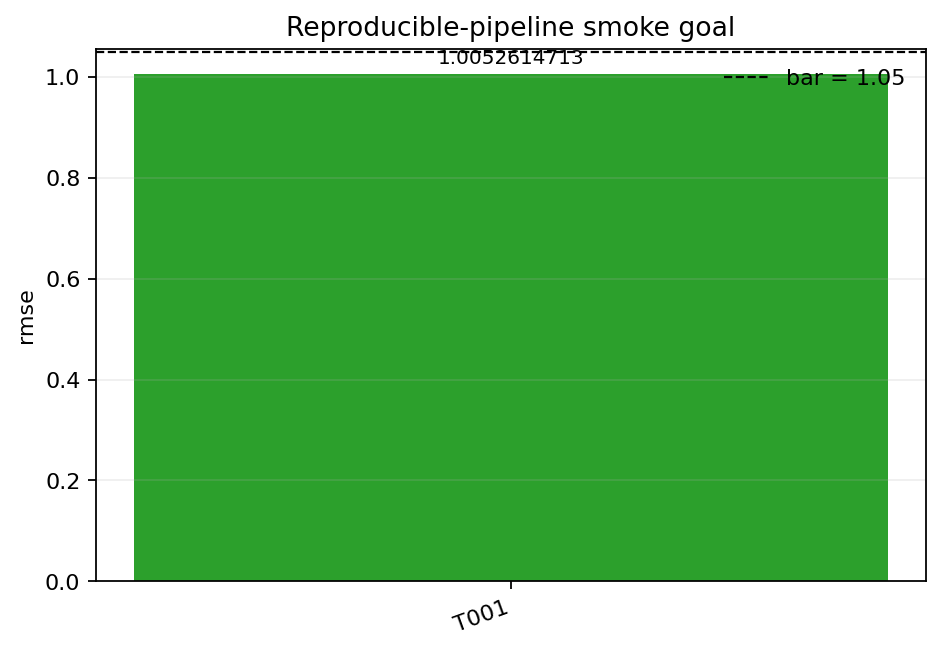

# Reproducible-pipeline smoke goal

**Authors:** example-run

## Abstract

This paper asks: does the goal -> task -> run -> verify loop work end to end on a machine with no GPU and no API tokens? The best observed result is 1.0052614713 versus the bar of 1.05, so the run beats the target.

## Method

does the goal -> task -> run -> verify loop work end to end on a machine with no GPU and no API tokens?

Experiment command: `python experiment.py --config config.json`

## Results

| task | n runs | mean value | beats bar |
| --- | --- | --- | --- |
| `T001` | 1 | 1.0052614713 | yes |

Best value: `1.0052614713`

Beats bar: `yes`

Confirmation: status=pending; supporting_workers=[]

## Reproducibility Appendix

- Worker: `example-run`
- Config hash: `sha256:919f20167e77d4057347446f6a9bb4101b5b121afe5b83f5bd3d659b41fdc9dd`
- Exact command: `python experiment.py --config config.json`
