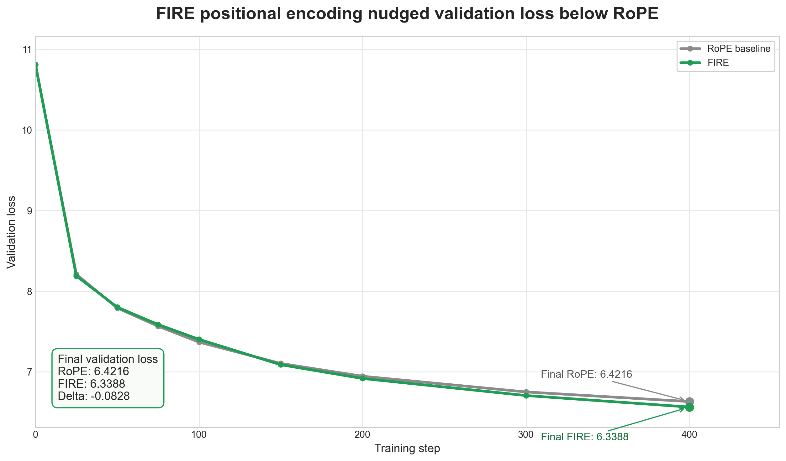

# FIRE positional encoding: a learned distance bias that can improve RoPE training
We swapped RoPE for a learned positional bias and validation loss improved.



**Author:** Vuk Rosić

## What it is
FIRE stands for Functional Interpolation for Relative Positions.
It adds a learned bias to attention scores.
The bias depends on token distance and token content.
That lets the model learn its own distance weighting instead of using a fixed recipe.
This is useful when nearby and far-away tokens should not be treated the same way.

## How it works
A compact FIRE block first projects each token into a small per-head space.
It then turns the source token and the target token into two scalar terms.
Those two terms are added together and scaled by a distance kernel.
The kernel keeps the bias strongest for nearby positions and weaker for distant ones.
The implementation below shows the core idea.

```python
phi_x = torch.einsum("btd,hed->bthe", x, phi)
term_t = torch.einsum("bthe,he->bth", phi_x, w_t)
term_s = torch.einsum("bthe,he->bth", phi_x, w_s)

bias = term_t.permute(0, 2, 1).unsqueeze(-1)
bias = bias + term_s.permute(0, 2, 1).unsqueeze(2)

idx = torch.arange(T, device=x.device)
diff = (idx[:, None] - idx[None, :]).abs()
bias = bias * gamma[diff][None, None]

attn_logits = attn_logits + bias
```

The zero-init scalar slices make the added bias start at exactly zero.
That keeps the first forward pass aligned with the baseline.
Training can then learn a better distance rule from data.

## Measured result
RoPE finished at 6.4216.
FIRE finished at 6.3388.
That is a delta of -0.0828.
The curve above shows FIRE ending below RoPE on the same trace.
