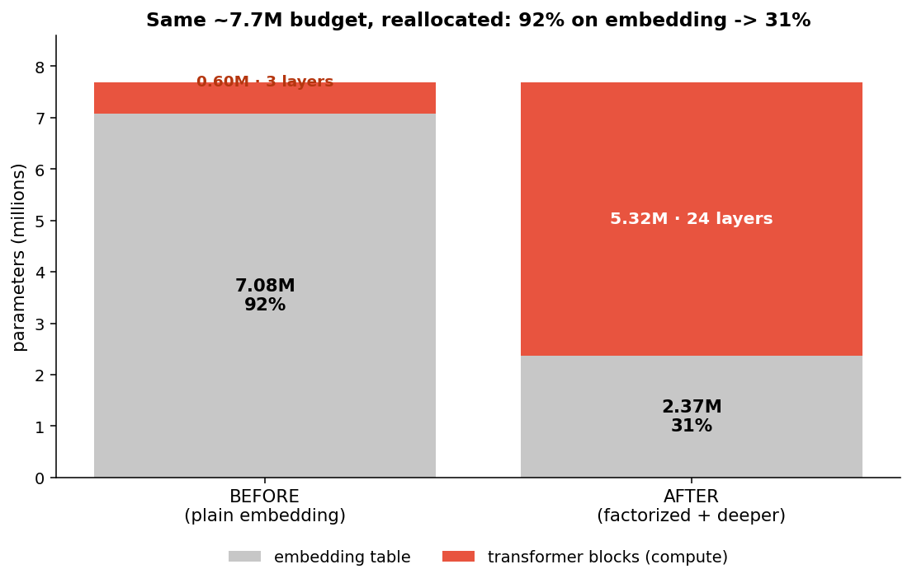
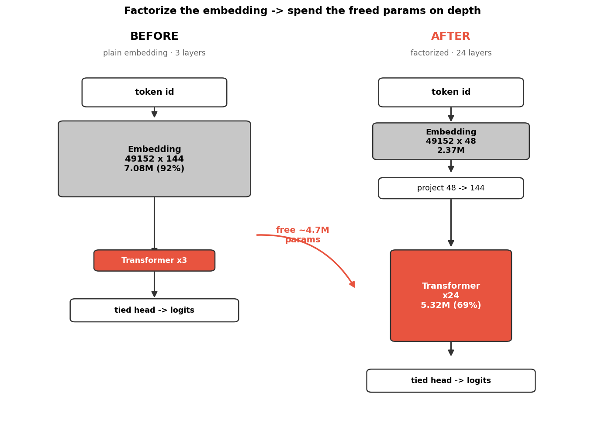
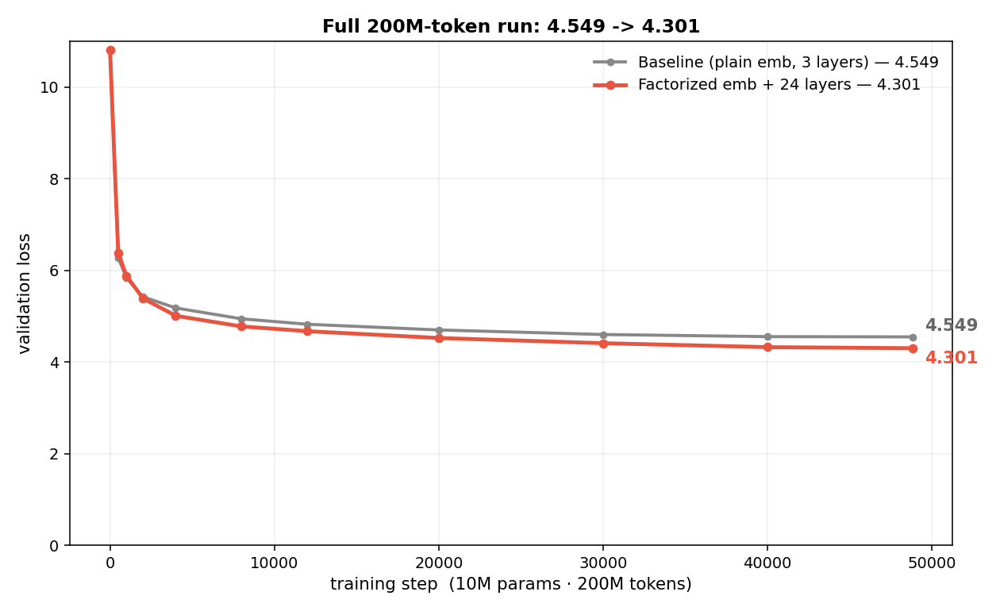

# 1 Pretraining Trick That Broke My LLM Record

**Result:** validation loss **4.549 → 4.301** on a 10M-param model, 200M tokens, one consumer GPU. Same parameter budget — I just spent it differently.

---

## The problem

I looked at where the parameters in my 10M model actually go. Almost all of them sit in one place: the **token embedding table**.

The table is `vocab × d_model = 49152 × 144 ≈ 7.08M` parameters. The whole model is ~7.7M. So the embedding is **92% of the model**, and the actual transformer — the part that *computes* — is only ~8%.

That felt wrong. A language model should spend its parameters thinking, not on a giant lookup table.



## The idea

You don't need a full `49152 × 144` table. You can **factorize** it into two smaller matrices:

```text
full:        49152 × 144                 = 7.08M params
factorized: (49152 × 48) @ (48 × 144)    = 2.37M params
                    ↑            ↑
              low-rank table   project up to d_model
```

I set the rank to `48` and tied the output head to the same table. That frees **~4.7M parameters** — and the model still has to map every token to a 144-dim vector, just through a 48-dim bottleneck first.

Then I spent the freed budget on **depth**: layers `3 → 24`. Same ~7.7M total, but now 69% of it is transformer blocks instead of 8%.



## Why it works

**Why shrinking 144 → 48 barely hurts.** The table stores a vector for all 49,152 tokens — but those vectors aren't random. Similar tokens (`cat`, `cats`, `kitten`) point in similar directions. The real information lives on a much lower-dimensional surface than 144 dimensions. Rank 48 says: *learn 48 numbers per token, then expand them up with one shared `48 × 144` matrix.* You only throw away capacity you weren't using — the same reason JPEG can drop most of an image's raw pixels and still look fine.

```text
plain:       token ──► [ 144 free numbers ]                      (lots of unused capacity)
factorized:  token ──► [ 48 numbers ] ──► (×W 48→144) ──► 144    (same vector, fewer params)
```

**Why depth wins here.** A plain embedding is pure *memory* — a lookup table. It stores facts but does no thinking. Transformer layers are where the model actually *computes*: mixing tokens, composing meaning. My old model spent 92% of its size on memory and 8% on thinking — almost all dictionary, almost no brain. That's why it plateaued. Moving parameters out of the lookup table and into 24 layers gave it room to actually *process* what it looked up.

**Why I tied the head.** The output head reuses the same embedding table instead of learning its own `49152 × 144` matrix. It saves another huge chunk of params and keeps the input and output living in the same space — a standard, well-tested trick.

## What I saw

I ran the full 200M-token run, same seed and setup, changing only this.



- The factorized+deeper model crosses the baseline by **step 2,000**.
- It's already under the old record at ~40% of the run.
- Final: **4.301 vs 4.549** — about **−0.18 nats**, perplexity ~94 → ~74 (~21% lower).

The 48-dim bottleneck costs almost nothing in quality, and the extra depth pays for itself many times over. The crossover at step 2,000 is the tell: a deeper model is slightly slower to warm up (more layers to organize), then pulls away and keeps widening the gap — exactly what you'd expect if the bottleneck is *capacity to compute*, not capacity to memorize.

## Lessons

The mechanism is small; the way of thinking is the part worth keeping.

1. **Profile before you optimize.** I didn't guess — I added up where the parameters actually went, and the problem was obvious the moment I looked. Most "ideas" should start from a measurement, not a hunch.
2. **The best wins are reallocation, not addition.** Same budget, spent smarter. Before adding anything, ask: *what is my model wasting capacity on?*
3. **Balance memory vs compute.** A model needs both a vocabulary (embedding) and the depth to use it. When one dominates the budget, shifting toward the other is often free performance.
4. **Compare against the right baseline, one change at a time.** I beat the *recent* 4.549, not the ancient 5.015 — otherwise I'd be crediting one trick for several changes. A clean comparison is what makes the result trustworthy.
5. **Always ask "does it transfer?"** Know the boundary of your result (see below). A win that only holds at one scale is still real — but overselling it is how you lose credibility.
6. **Small and cheap means more shots.** This was a ~$0.30, few-hour run on one GPU. Cheap experiments are exactly how you stumble onto reallocations like this — you can afford to look.

## The honest caveat

This win is partly an artifact of **scale**. The embedding is 92% of params *because the model is tiny*. At 135M params (`d_model = 576`) the embedding is only ~21% of the model — so there's far less to free, and this trick should shrink sharply as models get bigger.

It's a strong record at 10M. It is **not** a free lunch at scale. Don't oversell it.

## Interview question (test yourself)

> **Setup:** You're given a 10M-parameter transformer language model. You measure where the parameters live and find ~**92% sit in the token embedding table** and only ~8% in the transformer blocks. Validation loss has plateaued. **You can't increase the total parameter budget.** What do you change, and why?

**Answer.**

1. **Diagnose.** The model spends almost all of its capacity on a lookup table (memory) and almost none on layers (compute). It's a dictionary with no brain — that's why it plateaued.
2. **Free the wasted capacity.** Factorize the embedding from full rank to low rank: `49152×144 → (49152×48) @ (48×144)`. It's nearly lossless because token vectors are redundant (similar tokens share directions), so the signal survives a 48-dim bottleneck. Tie the output head to the same table to save even more. This frees ~4.7M params.
3. **Reinvest in compute.** Spend the freed budget on **depth** (layers 3 → 24), where the model actually processes information.
4. **Validate honestly.** Keep seed, data, tokens, and schedule fixed; change only this; compare to the *most recent* baseline (ideally multiple seeds). Look for a widening gap across the whole run, not just a better final number.
5. **State the limit.** This win is **scale-dependent** — the embedding is only 92% of params *because the model is tiny*. At larger `d_model` it's a small fraction, so the gain shrinks.

### Follow-ups they might ask

**Q: Why doesn't cutting 144 → 48 hurt accuracy much?**
Token embeddings are highly redundant; the useful information lives on a low-dimensional surface. A rank-48 bottleneck keeps it — the same principle as PCA or JPEG keeping only the components that carry signal.

**Q: Why spend the freed params on depth instead of width?**
At this budget the bottleneck was *compute*, not per-layer width. Depth adds compositional transformations — the model can build meaning across layers. (Worth testing both; depth won here.)

**Q: How do you know it's a real win and not noise or some other change?**
Change exactly one thing vs a fixed baseline, prefer multiple seeds, and check the *full curve*. Here it crosses the baseline by step 2,000 and the gap keeps widening — consistent with a genuine capacity effect, not a lucky endpoint.

**Q: Would this help a 1B model?**
Much less. The bigger the model, the smaller the embedding's share, so there's little to reclaim. It's a small-scale optimization, not a universal one.

## Reproduce it

```bash
python train_llm.py --config 10m --seed 42
```

- Model: 10M params · 200M tokens · seed 42 · bf16 · batch 2 · 48,829 steps
- Baseline to beat: 4.549 (`result/issue30-warmup-decay-w002-10m`)
- Champion: 4.301 (`result/10m-emb-factor-depth`, commit `cbe5677`)

Beat **4.301** on the `10m` config and you take the record. It's in the kit — come try.
