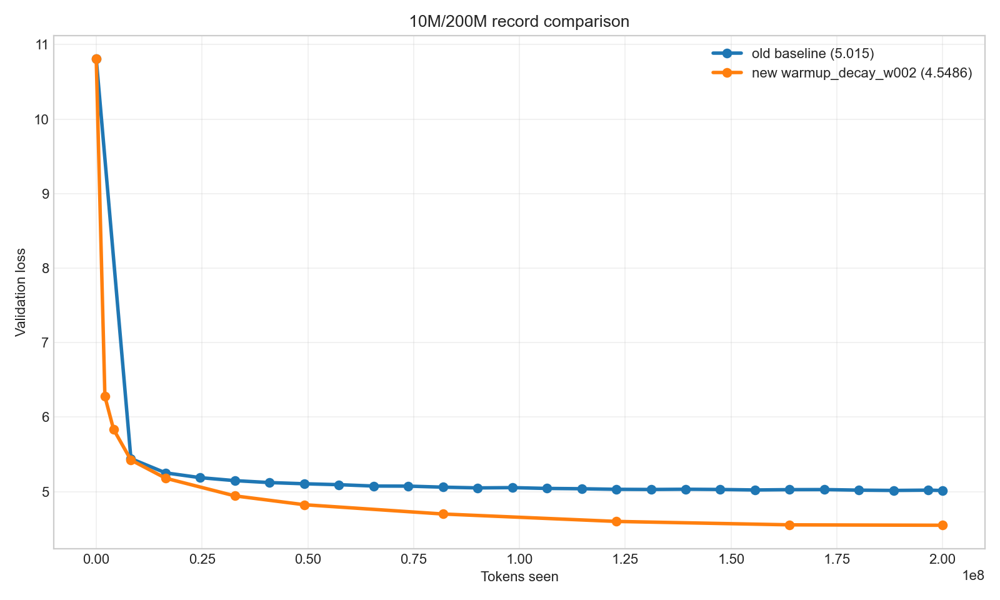
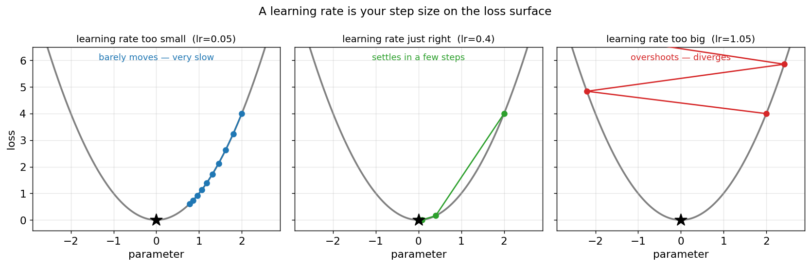
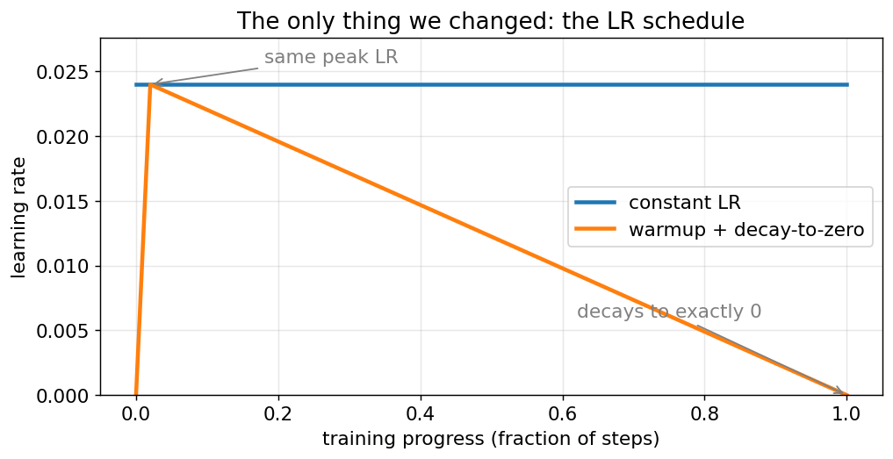
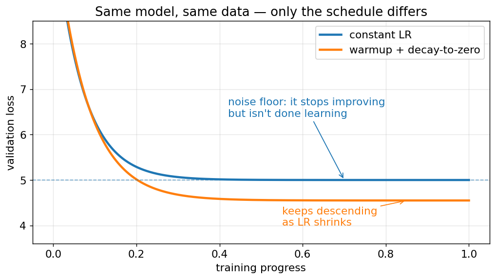
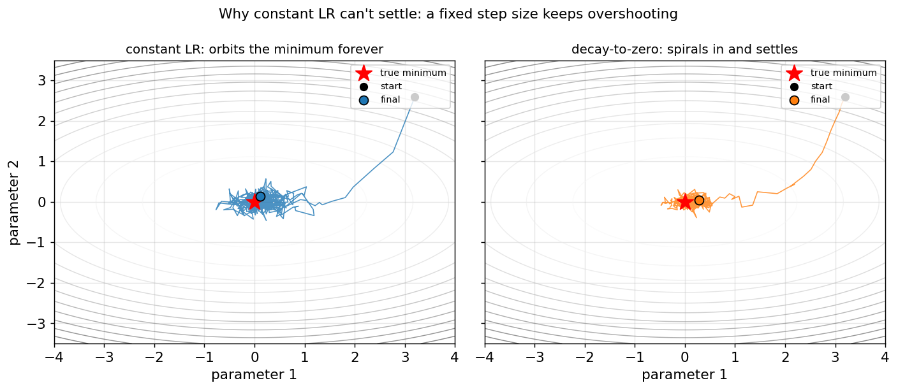
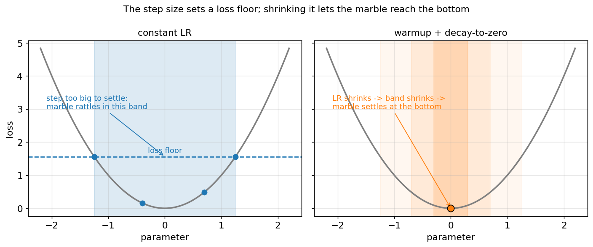
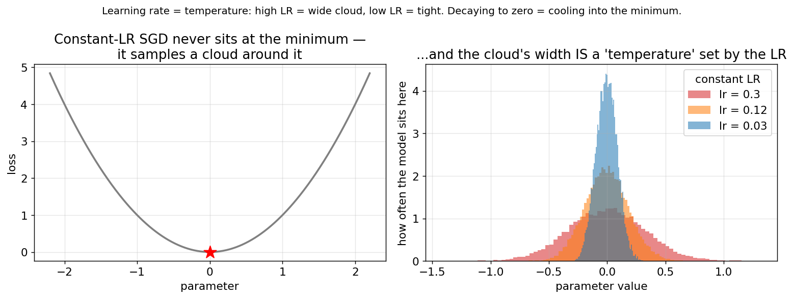
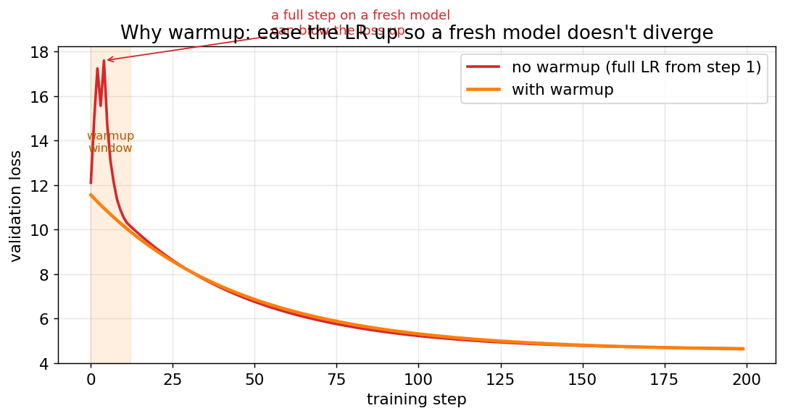
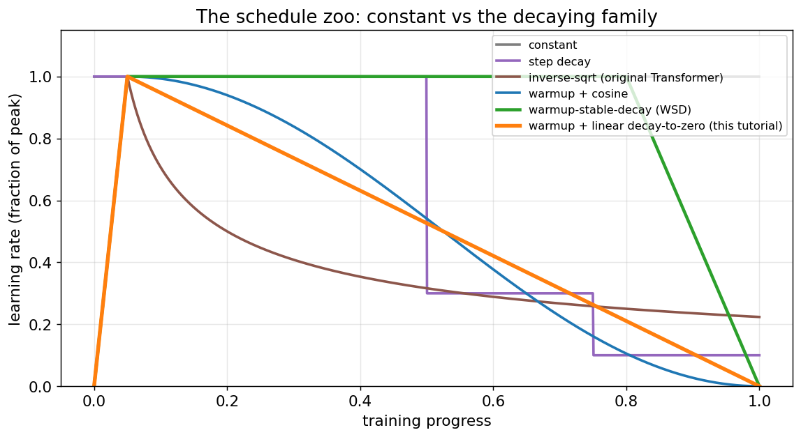
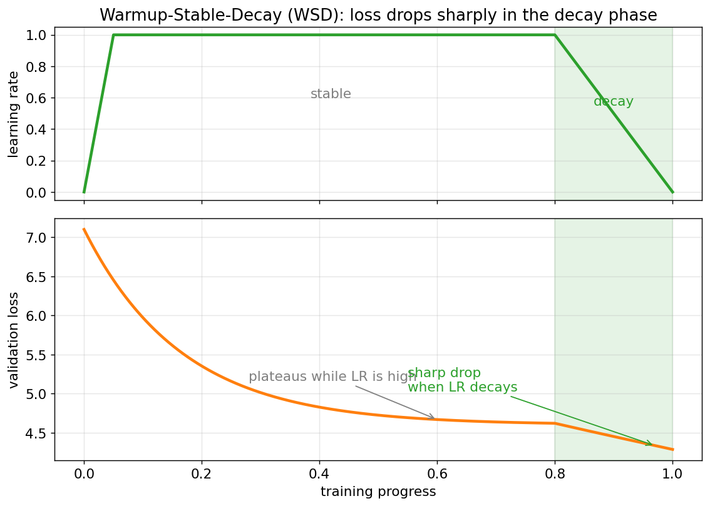

# Learning Rate Scheduling Tutorial: Warmup + Decay (Beginner-Friendly)

A from-scratch tutorial on **learning-rate (LR) schedules** — what they are, why a
constant LR quietly leaves performance on the table, and why **warmup +
decay-to-zero** is the schedule almost every serious model uses. No prior
knowledge needed beyond "a model learns by taking small steps."

**What you'll learn:**
- Why a constant learning rate hits a *floor* it can't get below
- The intuition (in 2D and 1D) for *why* decaying the LR fixes it
- Why you also want a short **warmup** at the start
- How to apply it in 3 lines — and proof it works on a real run

## A real example (proof this works)



To make this concrete: a ~10M-param model, 200M tokens, ~33 min on one consumer
GPU. We changed **one thing** — the LR schedule — keeping the same model, data,
seed, and peak LR.

| | constant LR (old) | warmup → decay (new) |
|---|---|---|
| final val loss | 5.015 | **4.549** |

Blue flattens early and stops. Orange keeps descending. The rest of this tutorial
is *why*.

## First: what is a learning rate?



The learning rate is just your **step size** as the model walks downhill on the loss
surface. Too small and it crawls. Too big and it overshoots the bottom and bounces
out. The "schedule" is simply **how you change that step size over training** —
and it turns out the *shape* matters a lot.

## What changed



Same peak LR — the only difference is the shape, and that the new one decays to
**exactly zero** by the end.

## The symptom: a noise floor



Constant LR doesn't "finish learning" — it hits a floor it can't get below.

## The cause, in 2D



Gradients are noisy (estimated from small batches). With a **fixed** step size, the
noise keeps kicking the marble back up the bowl — it **orbits** the minimum forever.
**Shrinking** the step shrinks the kicks, so it **spirals in and settles.**

## The cause, in 1D



The step size sets a *band* the marble rattles in — and the band's edge is the loss
floor. Constant LR fixes that floor; decaying to zero removes it.

## The one-word version: temperature



There's a clean way to say all of the above: **the learning rate acts like a
temperature.** A constant LR never settles at the minimum — it samples a *cloud* of
parameter values around it, and the cloud's width grows with the LR. Decaying the LR
to zero is **simulated annealing**: you cool the system until the cloud collapses
onto the minimum. (This isn't hand-waving — it's the SGD-as-sampling result from
Mandt et al. 2017 and Smith & Le 2018.)

## Why warmup too



A fresh model is badly conditioned — a full step on step 1 can blow it up. Warmup
eases the LR up so you can use a high peak safely. High peak = fast middle; decay to
zero = low floor at the end. You want both.

> Constant LR trains to an **equilibrium**, not a minimum. Decaying to zero pays back
> that leftover loss — for free. It's why every serious LLM uses a decay schedule.

## Where this sits: the schedule zoo



Warmup + linear-decay isn't the only option — it's one of a family. The original
Transformer used inverse-sqrt; SGDR popularized cosine; modern LLMs increasingly use
**Warmup-Stable-Decay (WSD)**: warm up, hold the LR flat for most of training, then
decay at the end.

## The signature of decay: a sharp late drop



WSD makes the effect from this whole tutorial impossible to miss: the loss
*plateaus* while the LR is high (the noise floor), then **drops sharply the moment
the decay phase starts.** That late drop is the leftover loss you were leaving on the
table — and it's exactly the blue-flattens / orange-keeps-falling curve from the top,
just made obvious. Our linear decay-to-zero is the same idea with the decay spread
across all of training instead of bunched at the end.

## Where this comes from (further reading)

This is standard practice with a real lineage — borrow its credibility:

- **Mandt, Hoffman & Blei 2017**, *SGD as Approximate Bayesian Inference* — constant
  LR converges to a distribution (the cloud), not a point.
- **Smith & Le 2018**, *A Bayesian Perspective on Generalization and SGD* — LR as
  temperature; decay = annealing.
- **Vaswani et al. 2017** (Transformer) and **Goyal et al. 2017** (ImageNet in 1
  Hour) — where warmup came from; **Liu et al. 2020** (RAdam) — *why* it helps.
- **Loshchilov & Hutter 2017** (SGDR / cosine) and **Smith 2017** (cyclical / 1-cycle)
  — the decay-schedule family.
- **Hoffmann et al. 2022** (Chinchilla) — the decay length must match your token
  budget. **Hu et al. 2024** (MiniCPM / WSD) — the sharp decay-phase drop shown above.

## How to apply it

The whole change is the schedule: a short linear **warmup** (~2% of steps) up to
your peak LR, then a linear **decay to exactly zero** by the last step. That's it.

```bash
cd docs/tutorials/lr_schedules
python generate_figures.py          # regenerate the intuition figures (synthetic)

# the only difference between these two runs is the schedule:
python train_llm.py --config 10m --schedule_type warmup_decay_to_zero --warmup_ratio 0.02 --seed 42  # warmup + decay
python train_llm.py --config 10m --schedule_type constant --seed 42                                   # constant baseline
```

**Takeaway:** if you train anything with SGD/Adam and you're on a constant LR,
switching to warmup + decay-to-zero is one of the cheapest wins available — same
compute, lower loss.
