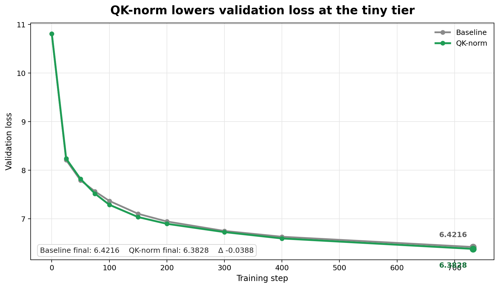
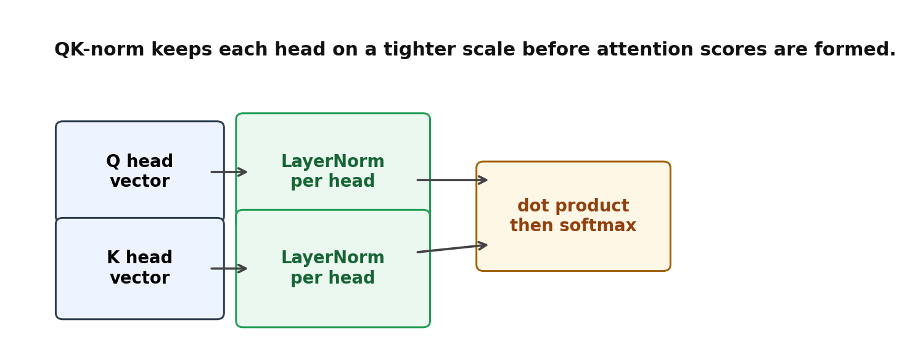

# QK-norm: the small attention change that quietly lowers validation loss

We added this trick to a model and validation loss improved:



**Author:** Vuk Rosić

QK-norm adds LayerNorm to the query and key vectors inside attention.
It makes each head compare vectors on a steadier scale.
That keeps attention scores from getting too sharp or too flat.
A steadier score range gives softmax more room to choose.
The change stays local to attention, so the rest of the model can stay the same.



On the tiny tier, with seed 42, 3,000,000 training tokens, a Tesla V100, and a 20M-token slice of `vukrosic/blueberry-1B-pretrain`, `Tiny1M3MQKNormConfig` beat `Tiny1M3MConfig` from 6.4216 to 6.3828.
That is a delta of -0.0388.
The curve above shows the gap across the logged steps, not just at the end.

## How it works

`Tiny1M3MQKNormConfig` is the baseline `Tiny1M3MConfig` with `use_qk_layernorm=True`.
That flag swaps the default Q and K normalization for per-head `nn.LayerNorm(d_head)`.

```python
q = self.q_proj(x).view(B, T, n_heads, d_head)
k = self.k_proj(x).view(B, T, n_heads, d_head)

if self.use_qk_layernorm:
    q = self.q_norm(q)
    k = self.k_norm(k)

scores = (q * k).sum(dim=-1) / math.sqrt(d_head)
```

`q_norm` and `k_norm` are separate modules, so query and key get normalized independently.
That lets the model keep different query and key geometry after the scale is cleaned up.

QK-norm is not a global reset.
It only changes the vectors that feed attention scores.
That small constraint is enough to make the score path easier to train.
