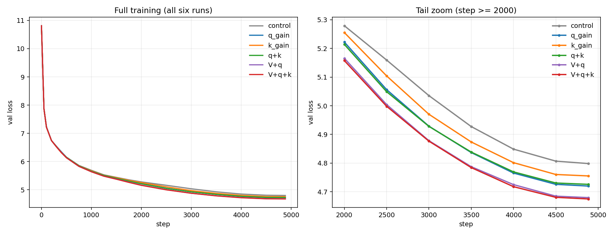
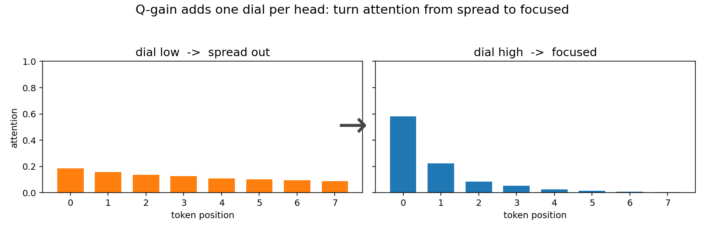
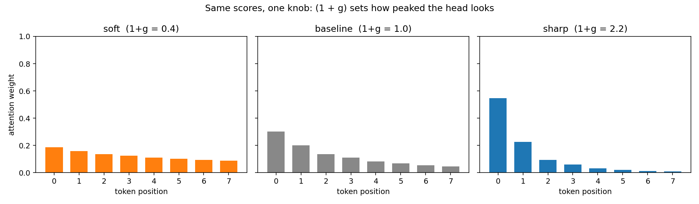
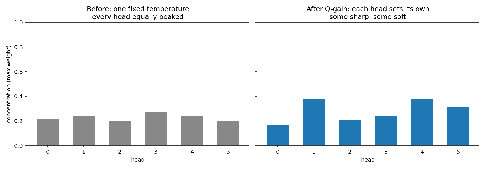
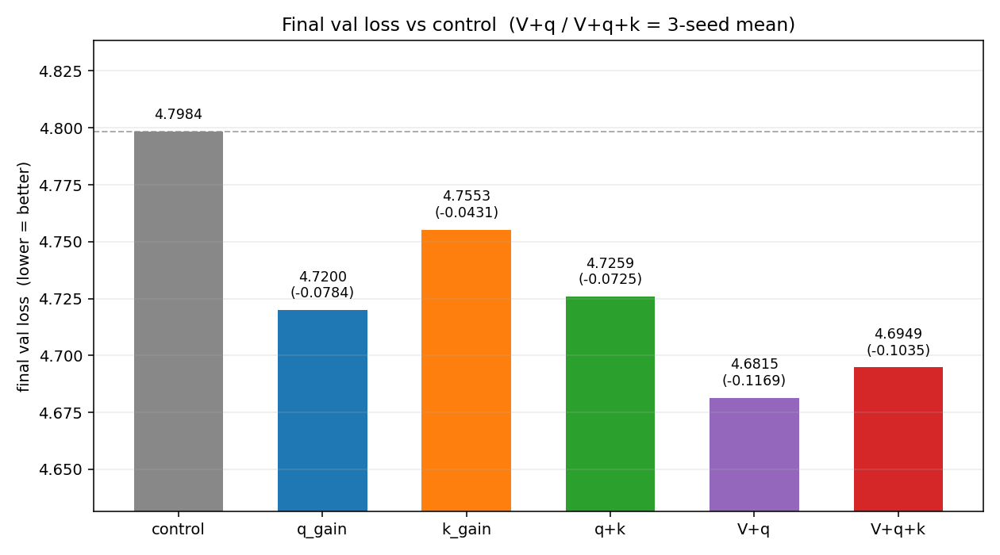

# 让注意力控制锐度

每个注意力头加一个可学习参数，用来控制注意力分数是更分散，还是更集中。

下面这些曲线来自一个约 7.7M 参数的 LLM，训练了 20M tokens。这个模型里，Q-gain 只增加了 144 个标量。



`g` 就是一个控制注意力锐度的可学习参数。每个头一个 `g`。

它可以加在 query（Q gain）、key（K gain）等位置。



---

标准注意力基线：

```text
score = (Q @ K.T) / sqrt(d_head)
```

Q-gain 会在计算分数前缩放这个头的 query 向量：

```text
Q' = Q * (1 + g)
score' = (Q' @ K.T) / sqrt(d_head)
       = score * (1 + g)
```

所以 `g` 就是 softmax logits 上的一个直接锐度旋钮。我们用 `(1 + g)`，这样 `g = 0` 就表示“什么都不改”，训练一开始就是完全基线。



- `g < 0` -> 更平坦 -> 平均更多 tokens
- `g = 0` -> 基线 -> 从这里开始，什么都不改
- `g > 0` -> 更尖锐 -> 更容易只盯住一个 token

---

**每个头都能自己选。** 基线把所有头锁在同一种锐度上。Q-gain 让每个头自己决定 - 有的更尖锐，有的更平缓。



---

## 代码

每个头一个可学习标量，零初始化：

```python
self.q_gain = nn.Parameter(torch.zeros(self.n_heads))     # one per head

Q_head = Q_head * (1.0 + g_head)
```

在这个 `screen10m` 模型上，额外成本是 144 个参数（6 个头 × 24 层），没有任何新的 matmul。
你不是在增加容量，你是在给已有能力一个新的旋钮。

---

## 结果

同样的配置，seed 42，训练到 20M tokens：



```text
control   4.7984
q_gain    4.7200   -0.0784
```

**144 个参数换来 -0.078 的验证损失。** 这就是这个方法的核心。
