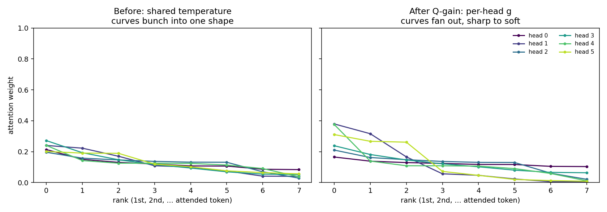
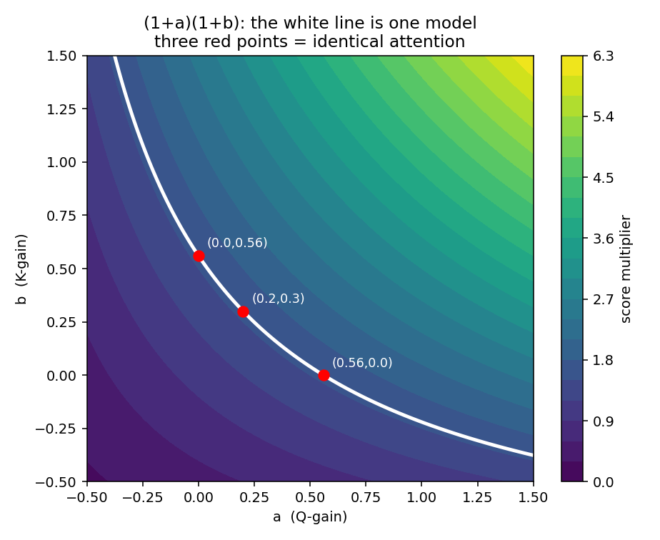

# Q-gain and K-gain: Two Knobs for One Screw


Q-gain adds one number per head. Turn it up, the head focuses on one token. Turn
it down, the head spreads across many. That is the whole idea.

Now look at the three pictures below. They carry the lesson. The text under each
is just a caption.

---

**One head, one knob.** Same scores every time — only `(1 + g)` changes.


```text
g < 0  ->  flat    ->  averages many tokens
g = 0  ->  baseline
g > 0  ->  peaked  ->  commits to one token
```

**Why `(1 + g)` and not just `g`?** So zero means "leave it alone." `g` starts at
0, and `1 + 0 = 1` is a factor that changes nothing — the model begins as the
exact baseline. Plain `g` would multiply the scores by 0 on the first step and
erase attention. So `g` is a learned *nudge around 1*, not the scale itself.

```text
factor = 1 + g
g = 0    ->  factor 1.0   ->  unchanged (this is where training starts)
g = 1.2  ->  factor 2.2   ->  sharper
g = -0.6 ->  factor 0.4   ->  softer
```

---

**Every head, before and after.** The baseline pins all heads to one sharpness.
Q-gain lets each head choose its own.


Same six heads drawn as their full attention curves: before, the shapes bunch
together; after, they fan out — head 1 commits hard, head 0 stays soft.



```text
before : one fixed temperature  ->  all heads equally peaked
after  : a per-head g           ->  each head sharp or soft, its choice
```

---

That freedom — sharpness picked per head — is the win. The rest of the lesson
measures it, then shows why the mirror trick, K-gain, adds nothing.

```text
prerequisites: attention scores, softmax, RoPE, this repo's 10m model
               (GQA, 6 query heads, 24 layers).
```

## Why That Knob Was Missing

A head decides where to look by computing scores, then softmaxing them.

The size of those scores sets how *sharp* the look is.

```text
big scores  -> peaked softmax -> the head copies one token
small scores -> flat softmax   -> the head averages many tokens
```

In the baseline, the only way a head can change its sharpness is to grow or
shrink its `Q`/`K` projection.

But those projections also decide *what* the head matches on.

So sharpness and content are entangled — a head cannot turn up its confidence
without also disturbing what it looks for.

Q-gain breaks that tie. It adds a dedicated scale that touches sharpness only.

A head decides where to look by computing scores, then softmaxing them.

The size of those scores controls how *sharp* the look is.

```text
big scores  -> softmax is peaked  -> the head copies one token
small scores -> softmax is flat    -> the head averages many tokens
```

In the baseline, the only way a head can change its sharpness is to grow or
shrink its `Q`/`K` projection.

But those projections also decide *what* the head matches on.

So sharpness and content are entangled — a head cannot turn up its confidence
without also disturbing what it looks for.

Q-gain breaks that tie. It adds a dedicated scale that touches sharpness only.

## Step 1: See What Q-gain Does

Q-gain gives each head one learnable scalar that scales its query vector.

```text
Q_head = Q_head * (1 + g)
```

`g` starts at 0.

At step 0 the factor is `(1 + 0) = 1`, so the model is exactly the baseline.

There is no warmup penalty and no init risk — the change switches on smoothly as
`g` moves away from 0.

Here is the real code from `models/layers.py`, applied after RoPE:

```python
if self.use_q_gain:
    Q = Q * (1.0 + self.q_gain.view(1, 1, self.n_heads, 1))
```

The parameter is a vector of zeros, one entry per head:

```python
self.q_gain = nn.Parameter(torch.zeros(self.n_heads))
```

## Step 2: Count the Cost

This is the cheapest kind of lever.

```text
heads per layer : 6
layers          : 24
extra params    : 6 * 24 = 144
extra matmuls   : 0
```

144 parameters on a 10M model is +0.0014%.

No new matrix multiply runs — it is an elementwise scale.

You are not adding capacity to the network. You are giving 144 existing knobs a
new place to turn.

## Step 3: Run It and Read the Curve

Train the control, then Q-gain alone, same seed:

```bash
# each run is ~15-20 min on a small GPU (RTX 3050); 4,883 steps, 20M tokens
python train_llm.py --config screen10m --train_tokens 16384000 --seed 42
python train_llm.py --config screen10m --train_tokens 16384000 --seed 42 --use_q_gain true
```

Every run below is the same config, seed 42, trained to the natural end
(step 4,883 ≈ 20M tokens).


The left panel looks like every loss curve — they all collapse together.

The right panel is the same data zoomed into the tail, where the runs actually
separate.

Read the tail from top to bottom: control is worst, then K-gain, then Q-gain,
then the V-embed stack at the floor.

The order on the right panel is the whole result.

## Step 4: Compare the Final Numbers


```text
control      4.7984     baseline
q_gain       4.7200     -0.0784   strong, cheap, real
k_gain       4.7553     -0.0431   real but weaker
q + k        4.7259     -0.0725   k adds ~nothing on top of q (+0.0059 vs q)
V + q        4.6815     -0.1169   3-seed mean, the champion base
V + q + k    4.6949     -0.1035   3-seed mean, k HURTS here (+0.0134 vs V+q)
```

Two facts to hold.

Q-gain alone is a genuine win — a per-head temperature is worth −0.078 for 144
parameters.

K-gain is a real lever by itself, but adding it on top of Q-gain does nothing
(the `q+k` bar) and adding it on top of the V+q champion makes things *worse*
(the last bar).

A lever that helps alone and hurts in company. Step 6 gives the leading
explanation — and the experiment that would confirm it.

## Step 5: Trust the Multi-seed, Not the Single Seed

One warning the data forces on you.

On seed 42 *alone*, V+q+k finishes at 4.6750 — slightly **better** than V+q's
4.6797 on the same seed.

If you stopped at one seed you would conclude K-gain helps.

The bars above use the **3-seed means** (seeds 42/43/44), where V+q is 4.6815 and
V+q+k is 4.6949.

```text
same-seed run-to-run noise on these runs : std ~ 0.02
single-seed V+q+k vs V+q gap             : -0.005  (inside noise, a lie)
3-seed mean V+q+k vs V+q gap             : +0.013  (outside noise, the truth)
```

A delta smaller than the noise band is not a result.

The K-gain effect only becomes real when you average the seeds.

## Step 6: The Leading Explanation — and What Would Confirm It

Write out what both gains do to a single head's score.

Q-gain scales `Q` by `(1 + a)`. K-gain scales `K` by `(1 + b)`.

The score is a dot product of the two:

```text
score = (1 + a) Q  .  (1 + b) K
      = (1 + a)(1 + b) . (Q . K)
```

The two scalars collapse into one number, `(1 + a)(1 + b)`, multiplying the
original score.

On paper there is only **one** effective knob per head — the combined
temperature — but you handed the optimiser **two** parameters to express it.

```text
one screw  : the per-head attention temperature
two knobs  : a (from Q-gain) and b (from K-gain)
```

This makes a clean prediction: K-gain should add nothing on top of Q-gain,
because it can only re-express a temperature Q-gain already reaches.

That matches the data — `q+k` ties `q`, and `V+q+k` is no better than `V+q`.

Be honest about the limit of this argument. The redundancy explains why K-gain
*cannot help*. It does not, by itself, prove why K-gain makes V+q slightly
*worse* (+0.0134). That extra knob could be hurting through worse optimisation
conditioning — a flat, degenerate direction the optimiser wastes steps on — and
that is a hypothesis, not a measured fact.

So this lesson has one open question, and it is yours to close.

two levers on the same axis do not stack — proving *why* the extra one hurts is
still open

## Hand Check: Watch Two Knobs Become One

Pick a head. Say the optimiser wants its scores multiplied by 1.56.

With Q-gain and K-gain it can reach 1.56 in endless ways:

```text
a = 0.20, b = 0.30  ->  (1.20)(1.30) = 1.56
a = 0.56, b = 0.00  ->  (1.56)(1.00) = 1.56
a = 0.00, b = 0.56  ->  (1.00)(1.56) = 1.56
```

Three different parameter settings. One identical model.

The picture makes it plain. Every `(a, b)` on the white line gives the same
score multiplier — the same model. The three red points are the rows above.



A single per-head temperature would be one axis, not this plane. The whole white
curve would collapse to one point. That is the redundancy you are paying for.

A single per-head temperature `t` reaches the same place with one number:

```text
(1 + t) = 1.56  ->  t = 0.56
```

Same expressive power. Half the parameters. No degenerate direction.

## The Experiment That Closes the Lesson (run this first)

The `(1 + a)(1 + b)` story predicts that a single per-head temperature recovers
all of Q-gain's win and that Q+K together never beats it.

Test it directly. The change is three lines in `Attention.forward`,
`models/layers.py` — drop the separate Q and K scales and scale the score once:

```python
# replace the use_q_gain / use_k_gain multiplies with one temperature
if self.use_qk_temp:                       # new flag, one Parameter(zeros(n_heads))
    Q = Q * (1.0 + self.qk_temp.view(1, 1, self.n_heads, 1))
```

Then screen it against Q-gain on the same seeds:

```text
prediction 1 : qk_temp final val  ==  q_gain final val   (within noise)
prediction 2 : adding k_gain to either changes nothing    (within noise)
```

If both hold, you have *shown* the redundancy instead of inferring it — half the
parameters, identical loss. If they do not hold, the entanglement story is
incomplete and you have found something more interesting than this lesson claims.

Post your two curves in the group. First clean confirmation goes in the lesson.

## What Else To Try (after the proof)

Ranked. Do the proof above first; these extend it.

```text
1. per-layer instead of per-head
   One scalar per layer, not per head. How much of the win needs head-level
   resolution?

2. inspect the learned gains
   Plot the 144 learned values by layer and head. Do early layers want sharp,
   late layers soft? Structure here is a finding on its own.

3. bounded init
   g = tanh(raw), so the gain can never run away. Was zero-init load-bearing or
   just convenient?

4. V-gain (a different screw)
   A per-head scalar on V scales the output, not the attention pattern. Does it
   stack where K-gain did not?

5. q_gain on the full champion stack
   Add q_gain to V + q + SWA + GELU and re-confirm it still pays. Levers can
   saturate once the stack is strong.
```

Screen every idea at 16M tokens first, multi-seed any delta inside +/- 0.10, and
promote to the 200M run only what clears the noise.

## Write Your Notes

Fill this in after your runs:

```text
control final val      : ____
q_gain final val       : ____   delta vs control: ____
q + k final val        : ____   delta vs q_gain : ____
qk_temp final val      : ____   delta vs q_gain : ____  (the proof)
my read of (1+a)(1+b)  : ____
```

## Done Checklist

You are done when:

- you can say in one sentence what a transformer lacks that Q-gain supplies (a
  per-head temperature decoupled from content)
- you know the cost is 144 params and zero new matmuls
- you can derive, from `(1 + a)(1 + b)`, why K-gain fails to stack on Q-gain
- you can name the part that is still a hypothesis (why the extra knob *hurts*)
- you can explain why the single-seed result lied and the 3-seed mean did not
- you ran the qk_temp proof, or read someone's posted curve, and know how it came
  out

Stop here. The next lever is value embeddings, which add capacity instead of
re-using it.
