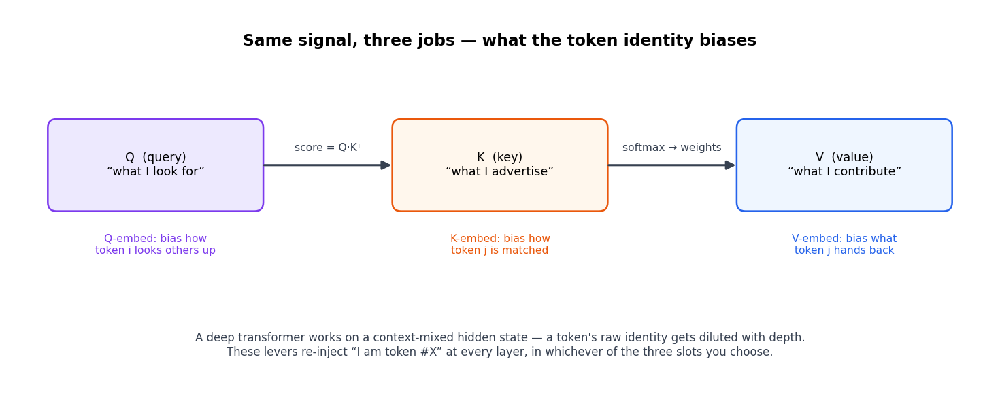
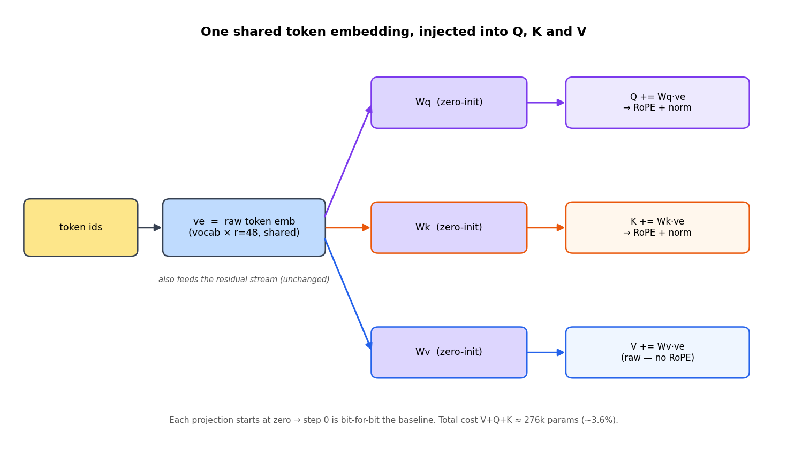
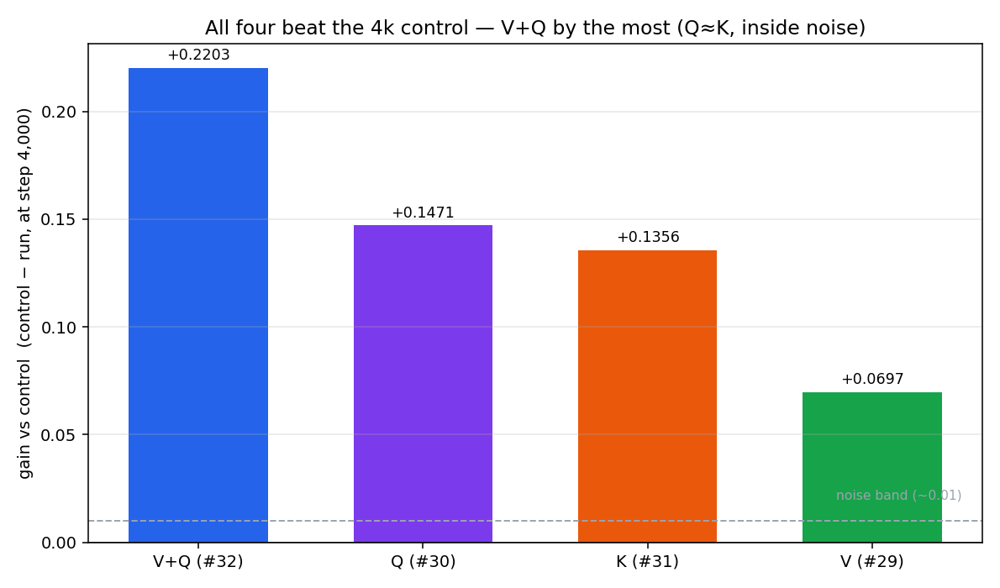

# Q / K / V Embeddings: feeding token identity into attention (`#29`–`#32`)

## The problem we need to solve

A transformer mixes each token with its context as it goes deeper. Every layer
blends a token's vector with the tokens around it — that's the whole point. But
it has a side effect: by the deep layers, the raw *"which token is this"* signal
is **diluted**. Attention is working on a context-blended vector, not the token's
own identity.

We want to hand attention back a clean *"I am token #X"* signal — at **every**
layer — without retraining the lookup or blowing the parameter budget.

## The fix, in one line

**Add the raw token embedding straight into the value projection:**

```text
V_j = W_v · h_j  +  W_ve · e_j
       \_______/    \_______/
      normal value   raw token identity, added back
```

`e_j` = the token's raw embedding (already computed at the bottom of the model).
`W_ve` = a tiny matrix that starts at zero. That's the whole idea.

The rest of this write-up does three things: applies that same one line to the
**query** and **key** too (`#29`–`#32`), explains why it works, and gives you
experiments to run.

> The V-only deep dive (the lever that started this) lives in
> [`../value_embeddings/`](../value_embeddings/README.md). This is the family +
> combination story.

---

## 1. Step 0 — standard attention (the starting point)

For each position `j`, the model holds a hidden state `h_j` (size `d_model`=144)
that earlier blocks built up. Attention makes three projections of it:

```text
Q_j = W_q · h_j     ← "what am I looking for"
K_j = W_k · h_j     ← "what do I offer as a match"
V_j = W_v · h_j     ← "what do I contribute when matched"
```

then, for each position `i`:

```text
score_ij = Q_i · K_j / sqrt(d_k)        for j ≤ i
weights  = softmax(score_i)
out_i    = Σ_j  weights_ij · V_j
```



The catch: `h_j` is **context-mixed**. By the time it reaches a deep layer it has
been blended with other tokens, positions, norms, and FFN outputs. That's the
whole point of a transformer — but a side effect is that the *raw identity* of
the token ("this slot is the word `the`") gets **diluted with depth**.

---

## 2. The trick — three places to inject identity

We re-inject the token's raw identity directly, at every layer. The source is
`ve` — the **factorized token embedding** (`vocab × r=48`), the *same* low-rank
table the model already looks up at the bottom. No new table; we reuse it.

**V-embed (`#29`)** — into the value:

```text
V_j = W_v · h_j  +  W_ve · e_j
```

What token `j` *hands back when attended to* now carries its persistent "I am
token #3827" signal, not just the diluted context vector.

**Q-embed (`#30`)** — into the query:

```text
Q_i = W_q · h_i  +  W_qe · e_i
```

Position `i`'s *lookup behavior* is biased by its own identity.

**K-embed (`#31`)** — into the key:

```text
K_j = W_k · h_j  +  W_ke · e_j
```

Token `j` *advertises* its identity for matching, context-independently.



### One structural difference that matters

Look at where the injection lands
([`models/layers.py`](../../../models/layers.py), `MultiHeadAttention.forward`):

```python
Q, K, V = qkv.split([self.q_size, self.kv_size, self.kv_size], dim=-1)
if self.use_value_embed and ve is not None:  V = V + F.linear(ve, self.value_embed_proj)
if self.use_query_embed and ve is not None:  Q = Q + F.linear(ve, self.query_embed_proj)
if self.use_key_embed   and ve is not None:  K = K + F.linear(ve, self.key_embed_proj)
# ... then ...
Q = self.rotary(self.q_norm(Q))   # Q-embed term gets RoPE + norm
K = self.rotary(self.k_norm(K))   # K-embed term gets RoPE + norm
#   V has no norm and no RoPE      # V-embed term stays raw
```

**Q and K go through RoPE + norm; V does not.** The Q/K injections get
*positionally rotated* — their identity signal is entangled with position — while
V's stays a clean, position-free contribution. That single fact is why V behaves
differently from Q/K (and is the best single placement at the natural end).

---

## 3. What "tiny zero-init projection" means

Each lever is one line of code. Using V-embed:

```python
self.value_embed_proj = nn.Parameter(torch.zeros(kv_size, 48))   # the projection W
V = V + F.linear(ve, self.value_embed_proj)                      # W · ve, added in
```

Three words:

| Word | Means | Here |
|---|---|---|
| **projection** | a learned matrix `W` that maps a vector from one size to another (`W·ve`) | maps the raw token embedding `ve` (48-dim) → attention's size (V/K: 48, Q: 144), then adds it onto V/Q/K |
| **zero-init** | `W` starts as **all zeros** | at step 0, `W·ve = 0` → the model is bit-for-bit the baseline; but a zero weight still gets a **nonzero gradient**, so it trains from step 1 and grows only as it helps |
| **tiny** | small parameter count | V/K: `48×48×24 layers ≈ 55k` (+0.7%); Q: `144×48×24 ≈ 166k` (+2.2%) — vs a ~7.7M model |

Why zero-init is the clever part:

- **Clean experiment** — step 0 == control, so any gain is *the mechanism*, not a
  lucky re-seed.
- **Safe** — a no-op at init that only turns on if it lowers loss (little downside).
- Using a raw `Parameter(torch.zeros(...))` (not `nn.Linear`) draws **no random
  numbers**, so every *other* weight stays identical to control too.

So a *tiny zero-init projection* = a small learned matrix, starting at zero, that
injects the token's identity into attention and earns its keep during training.

---

## 4. Why it works

- **Identity survives depth.** The residual stream dilutes "which token is this"
  as it goes up; these levers hand the raw signal back at every layer, in the
  exact subspace attention needs it.
- **Free reuse of an existing signal.** `e_j` is already computed (it's the input
  embedding). The only new parameters are the small `W_*e` projections — a vector
  routed through a learned matrix, so the model can place identity in the right
  head subspace. It's an *embed*, not a per-token bias scalar.
- **Low chance of harm.** Thanks to zero-init (§3), the worst case is "it stays
  off" — real upside, little downside.

---

## 5. What works — the results

Same schedule, same data, `seed=42`, run to the screen's natural end (step 4,882,
~20M tokens). Numbers from
[`docs/youtube-architecture-ablation-log.md`](../../youtube-architecture-ablation-log.md)
§10/§12/§13.

| Lever | Issue | Injects identity into | Cost | Natural-end (4,882) |
|---|---|---|---|---|
| **V-embed** | [`#29`](https://github.com/vukrosic/universe-lm/issues/29) | the **value** — what a token contributes when attended to | ~55k (+0.7%) | 4.7728 |
| **Q-embed** | [`#30`](https://github.com/vukrosic/universe-lm/issues/30) | the **query** — how a token looks others up | ~166k (+2.2%) | 4.8159 |
| **K-embed** | [`#31`](https://github.com/vukrosic/universe-lm/issues/31) | the **key** — how a token advertises itself | ~55k (+0.7%) | 4.8228 |
| **V+Q** | [`#32`](https://github.com/vukrosic/universe-lm/issues/32) | value **and** query | ~221k (+2.9%) | **4.7428** |


| step | V+Q | V | Q | K | control |
|------|-----|---|---|---|---------|
| 500  | 6.0992 | 6.4059 | 6.1853 | **6.1641** | 6.3972 |
| 1000 | 5.6015 | 5.8800 | 5.6941 | **5.6813** | 5.8853 |
| 4000 | **4.7875** | 4.9381 | 4.8607 † | 4.8722 | 5.0078 ‡ |
| 4882 | **4.7428** | 4.7728 | 4.8159 | 4.8228 | *pending* |

The shape is the story:

- **K/Q win the warmup.** At 500/1000 steps the score-side levers (K best, Q
  close) are ahead — injecting identity into the *match* helps fastest.
- **V wins the endgame.** V starts glued to the control (its zero-init `W` hasn't
  turned on yet), then overtakes by ~step 1500 and ends lowest of the singles.
- **V+Q is best everywhere.** Q's warmup edge + V's end-game edge don't cancel.

At the only checkpoint where we have a control (step 4,000), all four clear the
noise band by a wide margin:



For scale: the best *residual-rescale* lever in earlier rounds (LayerScale) topped
out at **+0.0106**. The smallest of these (V) is **+0.0697**, V+Q is **+0.2203** —
7×–20× the noise band.

---

## 6. Combining positions — V+Q (`#32`)

`Screen10M20MVQEmbedConfig` sets `use_value_embed=True` **and**
`use_query_embed=True`; the model computes `ve` once and shares it, so the
projections just add. Cost = V + Q ≈ **221k params (+2.9%)**.

**V+Q = 4.7428 — beats V alone by 0.0300** at the natural end. Honest caveat:
0.0300 is *inside* V-embed's ~0.06–0.16 single-seed noise band, so single-seed
certainty is weak. What we trust is the **direction** — V+Q is better at *every*
checkpoint from 500 on, matching the additive prediction.

---

## 7. Honest caveats (how *not* to overclaim)

- **This is a screen, not the record.** The 10M champion is measured at the full
  200M-token endpoint (val **4.3011**). These are ≤20M-token screens.
- **The natural-end control is not run yet.** The only control we have is gated at
  step 4,000 (5.0078, ~16M tokens). Comparing it to a 4,882-step number mixes
  token budgets — so we **do not** state a delta-vs-control at the natural end.
  *(That's Task 1 below.)*
- **One seed.** Run-to-run variance is ~0.06–0.16. Margins *vs control* are far
  outside that; the **Q-vs-K** and **V+Q-vs-V** gaps are *inside* it — treat them
  as ties / directions, not exact rankings.
- † Q@4k is read from milestone history inside the natural-end run. ‡ Control is
  gated at 4k, not natural-end.

---

## 8. The lesson

The headline isn't "Q/K/V-embeddings are great." It's the **screening discipline**:

1. When a whole *family* of tweaks lands in the noise (the residual-rescale round
   did), **change levers** — don't keep tuning the same knob.
2. Make every change **zero-init / baseline-equivalent**, so step 0 == control.
3. Compare against **fixed control checkpoints** — and never across different token
   budgets (hence "control pending").
4. **Kill** ideas when the curve stops supporting the story; **promote** the rare
   one that clears the noise band by a wide margin — and probe whether it
   *combines*.

---

## 🧪 Your turn — pick ONE experiment

Each is a real open question on this exact model. Run on a small GPU, `seed=42`,
~17 min each.

> **Post your val-loss number + loss curve, or a short writeup, in the
> [Skool community](https://www.skool.com/become-ai-researcher-2669/about) — I
> review every submission.** Pick the one that grabs you.

### Task 1 — Run the missing control  ⭐  *(no code, highest leverage)*

We have **no natural-end control**, so right now nobody can honestly state a
delta-vs-control at step 4,882 (the results table says *pending*). Fill it:

```bash
python train_llm.py --config 10m \
  --config_class configs.llm_config.Screen10M20MConfig --seed 42
```

**Report:** val loss @ 4,882. This single number makes *everyone's* deltas honest.

### Task 2 — V+Q+K, the combination probe  ⭐⭐

**Falsify this:** "K is redundant with Q" (both feed the score, both get RoPE'd),
so **V+Q+K ≈ V+Q** within ±0.03. Add one config class to
[`configs/llm_config.py`](../../../configs/llm_config.py) (next to
`Screen10M20MVQEmbedConfig`):

```python
@dataclass
class Screen10M20MVQKEmbedConfig(Screen10M20MConfig):
    """V+Q+K — all three positions. ~276k extra params (~3.6%)."""
    use_value_embed: bool = True
    use_query_embed: bool = True
    use_key_embed: bool = True
```

```bash
python train_llm.py --config 10m \
  --config_class configs.llm_config.Screen10M20MVQKEmbedConfig --seed 42
```

**Report:** val loss @ 4,882 vs **V+Q 4.7428**. Inside ±0.03 → K is redundant;
clearly lower → the additive story has more room.

### Task 3 — O-embed: a brand-new 4th position  ⭐⭐  *(writeup-friendly)*

We tried Q, K, V. **Nobody has screened the attention *output* yet.** The code is
already wired (`#33`, `--use_output_embed`) — inject identity *after* the heads
combine, post-O:

```bash
python train_llm.py --config 10m \
  --config_class configs.llm_config.Screen10M20MConfig --use_output_embed true --seed 42
```

**Report:** val loss @ 4,882 **plus a short writeup** — does a post-attention
position beat / tie / lose to V (4.7728)? Why might injecting *after* the mix
behave differently from injecting into Q/K/V?

> *Other open probes if none of these grab you:* **V+K** (is K a better partner for
> V than Q?), **deep-value-embed**, or invent your own position and write it up.

---

## Reproduce / code

```bash
# the four runs in this write-up (each ~17 min, seed=42):
python train_llm.py --config 10m --config_class configs.llm_config.Screen10M20MValueEmbedConfig --seed 42   # V   (#29)
python train_llm.py --config 10m --config_class configs.llm_config.Screen10M20MQueryEmbedConfig --seed 42   # Q   (#30)
python train_llm.py --config 10m --config_class configs.llm_config.Screen10M20MKeyEmbedConfig   --seed 42   # K   (#31)
python train_llm.py --config 10m --config_class configs.llm_config.Screen10M20MVQEmbedConfig    --seed 42   # V+Q (#32)

# regenerate the figures in this folder:
python docs/tutorials/qkv_embeddings/make_figures.py
```

**Code:** [`models/layers.py`](../../../models/layers.py) (`MultiHeadAttention` —
the injection points), [`models/llm.py`](../../../models/llm.py) (`ve` source —
the shared factorized embedding), flags `use_value_embed` / `use_query_embed` /
`use_key_embed` / `use_output_embed` in
[`configs/llm_config.py`](../../../configs/llm_config.py).
**Full log:** [`docs/youtube-architecture-ablation-log.md`](../../youtube-architecture-ablation-log.md)
§9–§13. **Issues:** [`#29`](https://github.com/vukrosic/universe-lm/issues/29) ·
[`#30`](https://github.com/vukrosic/universe-lm/issues/30) ·
[`#31`](https://github.com/vukrosic/universe-lm/issues/31) ·
[`#32`](https://github.com/vukrosic/universe-lm/issues/32) ·
[`#33`](https://github.com/vukrosic/universe-lm/issues/33)
