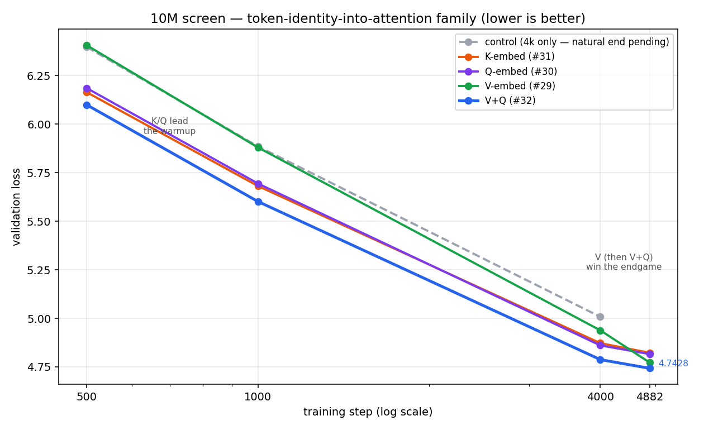

# Add Starting Token Embeddings Into Every Layer (−0.22 val loss) - Transformer (LLM) Pre-training

You are pre-training an LLM.

You realize that, as tokens pass through depth (transformer layers), they gain more and more context.

But wait — by processing them, aren't we burying the token's own original
information under the new context?

How would you try to hand it back to every layer, to see if it will help, using only what the model already computed?

Hint: the raw embedding is still sitting at the bottom of the model — unused after layer 0.

---

## My experiment

10M-param transformer, trained on ~20M tokens

The token's raw embedding is computed at layer 0, then never used again —
context dilutes it with depth. So I tried adding it back into attention at every layer (query, key, or value).

---

## Results (single seed @ 4,882 steps)

| inject into | extra params | val loss |
|---|---|---|
| K (key) | +0.7% | 4.8228 |
| Q (query) | +2.2% | 4.8159 |
| V (value) | +0.7% | 4.7728 |
| **V+Q** | +2.9% | **4.7428** |

The shape, not the ranking, is the story: **K/Q lead early, V wins late, V+Q
best throughout.**



---

## Honest caveats

- One seed. Run-to-run variance ~0.06–0.16, so the V-vs-Q gap is *direction*,
  not a verdict.
- This is a 20M-token **screen**, not the full record.
- Natural-end control not finished — no exact delta-vs-control at 4,882 yet.

---

## How I added it back

One line per spot — a tiny matrix that starts at **all zeros**:

```text
V = W_v · h  +  W_ve · e      # e = the raw token embedding from layer 0
                \______/
              W_ve starts at zero → step 0 is bit-for-bit the baseline
```

**Why start at 0:**

- **Step 0 = exact baseline** — `W_ve · e = 0`, so any later gain is the mechanism, not a lucky re-seed.
- **Earns its way on** — zero weight still gets a nonzero gradient, so it trains from step 1, but only grows if it lowers loss.
- **Little downside** — worst case it stays ~0 (a no-op); you never risk the baseline to test the idea.

Same one line works for Q and K — that's the "where" I was testing.

**The matrices:** every layer gets its own (24 layers → 24 separate matrices, no sharing). Each maps `e` (48-dim) → the attention slot:

- **V / K:** `48 × 48` per layer → ~55k params total (+0.7%)
- **Q:** `144 × 48` per layer → ~166k total (+2.2%) — bigger because the query slot is the full `d_model=144`, while K/V slots are 48.

---

Want the full method + code? → Become AI Researcher (Skool):
https://www.skool.com/become-ai-researcher-2669/about
