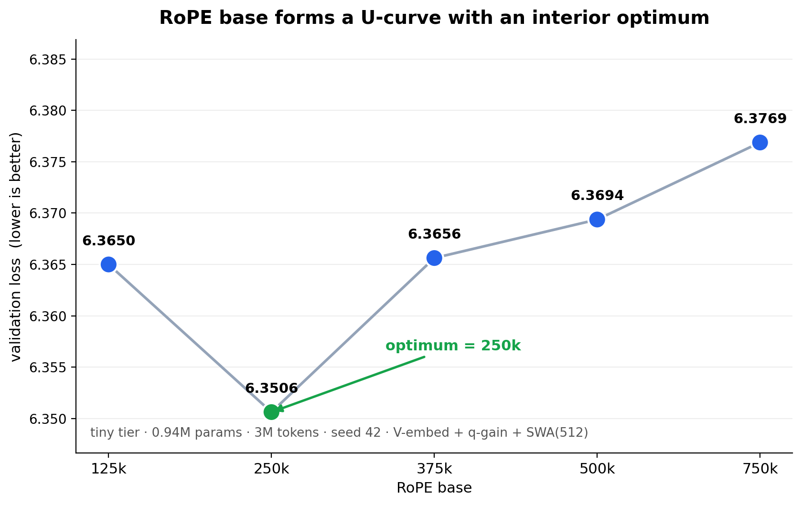

# 扫一下 RoPE base，训练可能会更快

很多人会直接把 RoPE base 设成 `10,000`。

更好的做法是：让 Codex / Claude 帮你做一次小 sweep。

这张曲线很直观。



- 短上下文 / 小模型：可以试低一点的 base，比如 `10k`、`25k`、`50k`、`100k`
- 长上下文 / 大模型：可以试高一点的 base，比如 `100k`、`250k`、`500k`、`750k`

RoPE base 只是一个整数。

它不增加参数，不改变 tensor shape，但仍然可能移动验证损失。

为什么 `10k` 这么常见？

因为它来自早期 sinusoidal / rotary 位置编码的默认习惯，在很多短上下文设置里够用。

但它是历史默认值，不是每个模型规模、每个上下文长度下都测出来的最优值。

---

我的一个 tiny sweep：约 `1M` 参数，训练 `3M` tokens。

| RoPE base | 验证损失 |
|---|---:|
| `125k` | `6.3650` |
| `250k` | `6.3506`（最好） |
| `375k` | `6.3656` |
| `500k` | `6.3694` |
| `750k` | `6.3769` |

最低点在 `250k`。

这不是一个新模块，只是一个免费旋钮。

你可以用我的 LLM research kit 复现。

在 GitHub 搜索：`vukrosic universe-lm`

然后让 Codex / Claude：

```text
克隆这个仓库，帮我跑一个 RoPE base sweep。
```

如果你想系统学习怎么做这种小型 AI research，可以在 Skool 搜索：

```text
Become AI Researcher
```

这个社区也会支持我们继续做这些实验。
