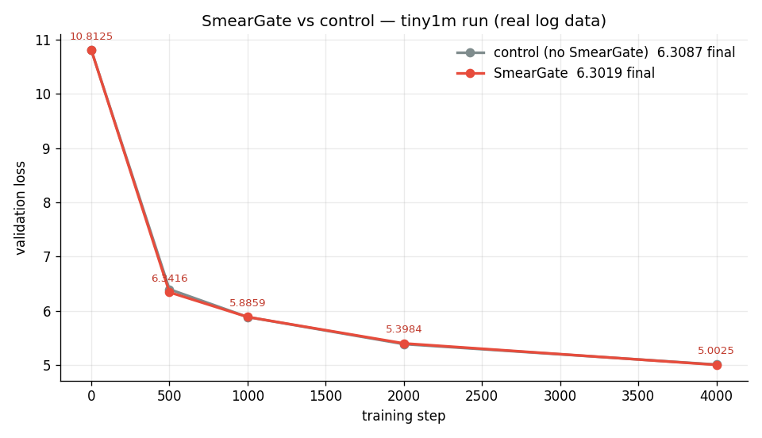
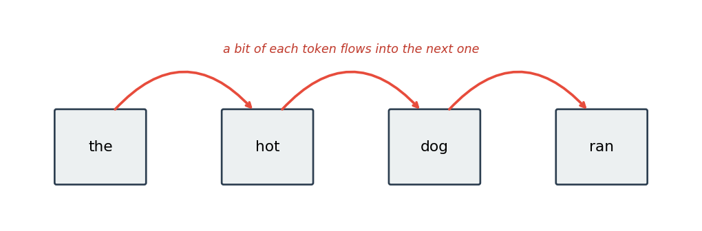
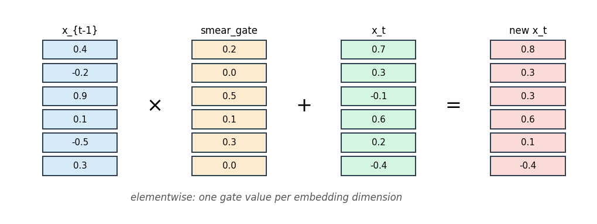

# Blend the Previous Token's Embedding to Improve Your LLM Training: SmearGate

We added this tiny trick to a small model and validation loss improved:



Each token mixes in a little bit of the token that came right before it.



This gives the model some local context for free, before the transformer even runs.

In code it's tiny: a learned vector, one value per embedding dimension.

The vector is zero-initialized, so it starts as a no-op.

It scales the previous token's embedding and adds it to the current one.



```text
x_t  <-  x_t  +  smear_gate * x_{t-1}        # smear_gate is a learned d_model vector, init 0
```

## How it works, step by step

Start with the token embeddings, one vector per position.

```python
# x shape: (seq_len, d_model) = (4, 3)
x = [[1, 0, 2],   # token 0
     [0, 3, 1],   # token 1
     [2, 1, 0],   # token 2
     [1, 1, 1]]   # token 3
```

Make a shifted copy where every position holds the embedding of the token before it.

```python
# prev shape: (4, 3)
prev = [[0, 0, 0],   # token 0  (filled in next step)
        [1, 0, 2],   # = old token 0
        [0, 3, 1],   # = old token 1
        [2, 1, 0]]   # = old token 2
```

The very first position has no previous token, so set its shifted value to zero.

```python
prev[0]   # [0, 0, 0]
```

Multiply that shifted copy by `smear_gate`, the learned per-dimension vector.

```python
smear_gate            # shape (3,)  = [0.5, 0.0, 0.2]   one value per dim
smear_gate * prev[1]  # [0.5, 0.0, 0.4]   scaled copy of old token 0
```

Because `smear_gate` starts at zero, this product is zero at the start of training.

```python
smear_gate            # [0.0, 0.0, 0.0]   at init
smear_gate * prev     # all zeros
```

Add the result back onto the original embeddings.

```python
x = x + smear_gate * prev
```

So at step 0 nothing changes, and the model behaves exactly like the baseline.

As training proceeds, `smear_gate` can grow, letting each token pull in part of its neighbor.

All of this happens once, on the embedding lane, before the transformer blocks run.

---

### Want to go deeper in AI research? I'll coach you 1-on-1

Bring whatever you're stuck on – picking a direction, your first experiment, a paper you can't crack, your training setup, or a career move.

📆 **$20 (80% OFF) for the founding cohort – first 8 spots.** Not a fit? I'll
refund in the first 10 minutes, no hard feelings.
→ https://cal.com/vuk-ai/60-min

### Not ready for a call? Start free in the Skool

Every experiment I post comes with the scaffolded code and a step-by-step
protocol, so you can reproduce it yourself and then run your own variant. You also get the weekly research thread and a community of people doing real AI research.
Free to try.
→ https://www.skool.com/become-ai-researcher-2669/about
