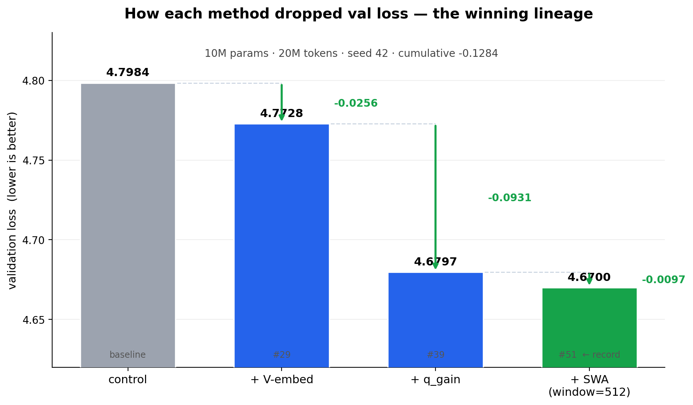

# Sliding-Window Attention: when full attention was wasting capacity

**Result:** V-embed + Q-gain + **SWA(window=512)** hit **4.6700** on the 10M
screen — a **−0.128** win over the no-flags baseline — and combined with
HighRoPE pushed the record to **4.6364**. Multi-seed mean of V+q+SWA is
**4.6676, std 0.0034** (seeds 42/43), tighter than V+q alone.

The attention matrix itself was a hidden lever. Default causal attention was
letting every token see the whole past; a 512-token window turns out to be the
sweet spot at our `seq_len=2048` scale.



---

## The problem

Standard causal attention: every token attends to **all** previous tokens. For
`seq_len=2048`, that's a `2048 × 2048` attention matrix per head per layer.

Two things that bothered me:

1. **The matrix is mostly noise at depth.** The first 32 tokens of context
   matter; token #2,000 mostly does not — for the kinds of structure a 10M
   model can actually use. We're paying quadratic cost for long-range signal
   the model can't read.
2. **GQA was already telling us the long tail is small.** We share 2 KV heads
   across 6 Q heads with no measurable loss. The KV pool is already
   compressed; the **pattern** is the next obvious place to compress.

So the question: **how much of the long-range pattern can we cut?**

---

## The fix

Replace the full causal mask with a local causal window of width `W`:

```text
full causal (default):
  token i sees: 0, 1, 2, ..., i              (density 1.0)

SWA(window=W):
  token i sees: max(0, i-W+1), ..., i        (density W/seq_len)
```

For `W=512, seq_len=2048`, mask density is `0.2188` — about a fifth of the
default. **Flag-only, no extra parameters.** We replace SDPA's
`is_causal=True` with an explicit `causal ∧ local` boolean mask; same code
path, different mask.

---

## Window sweep — 512 is the sweet spot

Same recipe (V-embed + Q-gain + RoPE base=500k), seed 42, screen20m natural
end:

| Window | Val loss | Δ vs 512 |
|---|---|---|
| no SWA (full) | 4.6841 | +0.048 |
| 256 | 4.6672 | +0.031 |
| **512** | **4.6364** | **0 (winner)** |
| 768 | 4.6500 | +0.014 |
| 1024 | 4.6517 | +0.015 |
| 2048 (full-window control) | 4.65xx | +0.014 |

`512` wins. Smaller is too aggressive (loses useful local context past 256),
larger is wasted (going back to 2048 doesn't help, and the *no* SWA case
wins by *less* than 1024 — meaning long-range isn't zero, it just dilutes the
local signal).

**SWA alone is a real lever.** Removing V-embed and Q-gain from the recipe:

| Setup | Val loss | Δ vs ctrl |
|---|---|---|
| control (no flags) | 4.7984 | 0 |
| **SWA(window=512) only** | **4.7552 ± 0.027** | **−0.043** |

`#52` — 2-seed mean 4.7552, std 0.027. SWA captures ~half the V+q_gain win
*on its own*. **The attention pattern is not free; it was a lever all
along.**

---

## The result on the best baseline

V-embed + Q-gain + SWA(512) + RoPE-base=500k → **4.6364**, current screen20m
record. The load-bearing combination after 12 closed axes (GELU, layer
tying, MHA, Tied QK, MLA, dilated, post-norm, GQA1, no-emb-scale, logit
softcap, window-1024, no-SWA).

12 closed axes on this baseline — none beat it:

| axis | val | Δ vs best | verdict |
|---|---|---|---|
| GELU | 4.6527 | +0.016 | GELU flips from additive to anti-additive on HighRoPE |
| layer tying (group=2) | 4.7133 | +0.077 | tying anti-additive again |
| MHA (n_kv_heads=6) | 4.6384 | +0.002 | GQA ratio is a wash |
| Tied QK (PaLM) | 4.6500 | +0.014 | QK tying doesn't help |
| MLA (DeepSeek-V2) | 4.7269 | +0.091 | latent bottleneck worse |
| logit softcap=15 | 4.6777 | +0.041 | Gemma cap doesn't help |
| SWA window=256 | 4.6672 | +0.031 | too small |
| SWA window=1024 | 4.6517 | +0.015 | too large |
| no SWA | 4.6841 | +0.048 | SWA is still load-bearing |
| post-norm | 5.3816 | +0.746 | post-norm collapses training |
| dilated (d=2) | 5.2494 | +0.613 | strided pattern breaks training |
| GQA=1 | 4.6761 | +0.040 | max KV sharing hurts |

---

## The code

One flag, one mask, ~10 lines:

```python
# configs/llm_config.py
use_sliding_window: bool = False
sliding_window_size: int = 512
```

```python
# models/layers.py — MultiHeadAttention.forward
if self.use_sliding_window:
    # build causal-local boolean mask, shape [seq, seq]
    idx = torch.arange(seq, device=q.device)
    local = (idx[None, :] - idx[:, None]) < self.sliding_window_size
    mask = torch.tril(torch.ones(seq, seq, device=q.device, dtype=torch.bool)) & local
    attn = F.scaled_dot_product_attention(Q, K, V, attn_mask=mask, is_causal=False)
else:
    attn = F.scaled_dot_product_attention(Q, K, V, is_causal=True)
```

**Zero new parameters.** The mask is rebuilt every forward (cheap on GPU,
negligible at our scale).

---

## Why it works

Two readings, both honest:

1. **Capacity reallocation.** By forcing attention to spend its capacity
   locally, the model is forced to learn *what local context is* — a stronger
   prior than "spread probability across 2,000 tokens and hope." This is the
   standard reading: SWA as a useful inductive bias at small scale.

2. **Optimization basin.** The fact that `no-SWA` lands at 4.6841 but
   `SWA(1024)` lands at 4.6517 (i.e. **wider window still loses to 512**)
   suggests this is partly about *where the loss landscape is smoothest*,
   not just what the model can in principle compute. SWA changes which
   basin the optimizer falls into.

Both readings are consistent with the data. The truth is probably "both,
with #2 dominant at this scale."

---

## Lessons

1. **The attention pattern is a real lever, not just an engineering
   choice.** A 10M model with SWA(512) is materially better than one
   with full attention — by more than the noise band.
2. **Window 512 is a clear optimum**, not a default. Both smaller (256)
   and larger (1024) lose. The standard "full attention is fine" assumption
   is **wrong at this scale**.
3. **Flag-only wins are the cheapest wins.** SWA adds zero parameters. If
   you can get −0.05 with a mask, do that before adding a projection.
4. **Multi-axis combinations beat single-axis.** V+q alone is 4.6815;
   +SWA is 4.6676; +HighRoPE is **4.6364**. The three together are
   **+0.045** better than the best single axis.

---

## Caveats

- **Single-seed for the full recipe.** V+q+SWA has 2-seed confirmation
  (4.6676 ± 0.0034). The full record 4.6364 is single-seed; we believe the
  direction is real but the exact number is ±0.01.
- **Scale-dependent.** The optimum window will likely grow with `seq_len`
  and model size. At 135M and 4k+ context, SWA(1024) or no-SWA may win.
- **Doesn't compose with everything.** GELU is additive on SWA(512) at
  base=10k but anti-additive at base=500k. The window is in conversation
  with the other axes.

---

## Reproduce

```bash
# the record recipe (single seed, ~30 min on RTX 3050):
python train_llm.py \
  --config screen20m \
  --use_value_embed true \
  --use_q_gain true \
  --use_sliding_window true \
  --sliding_window_size 512 \
  --rope_base 500000 \
  --seed 42

# regenerate the waterfall figure:
python docs/tutorials/swa_record/make_figures.py
```

Code: [models/layers.py](../../../models/layers.py) (`MultiHeadAttention.forward`),
flags in [configs/llm_config.py](../../../configs/llm_config.py) (`use_sliding_window`,
`sliding_window_size`).
Evidence: [LEADERBOARD.md](../../../LEADERBOARD.md) §`screen20m` row 18d,
`runs/s_vqgain_swa_highrope_full/metrics.json`.
