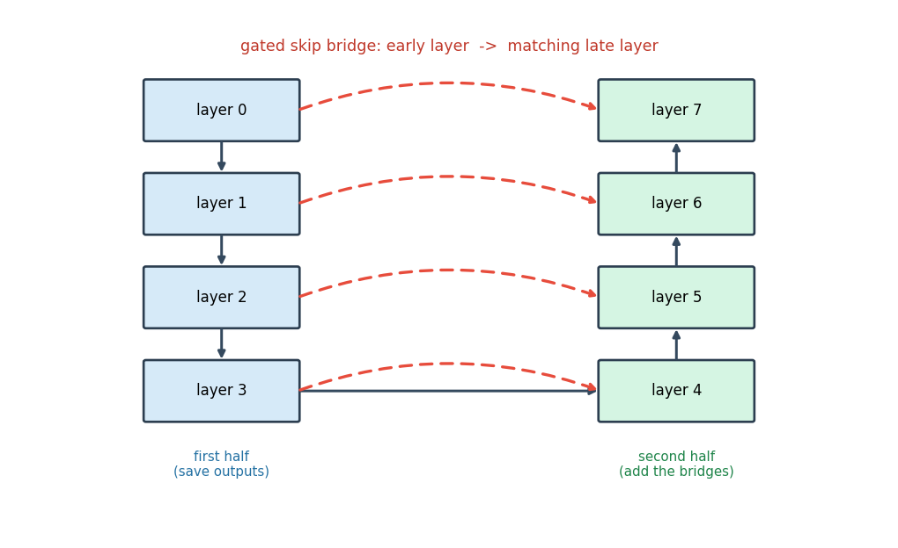
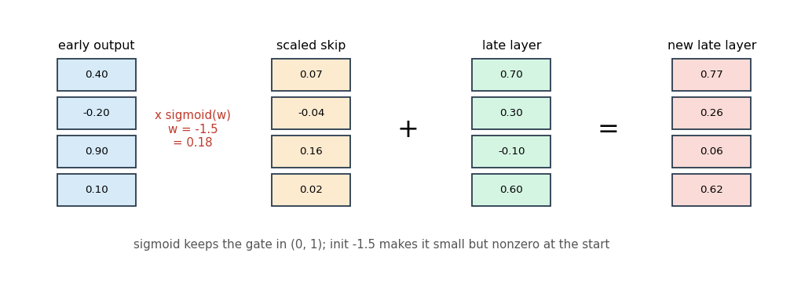
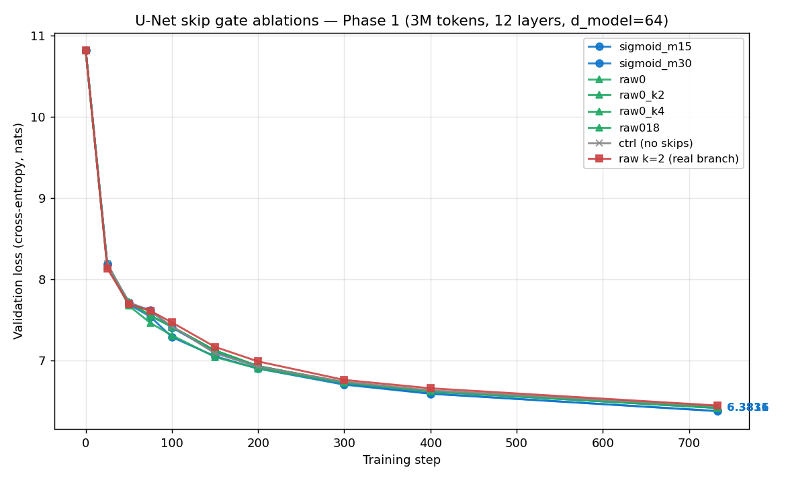
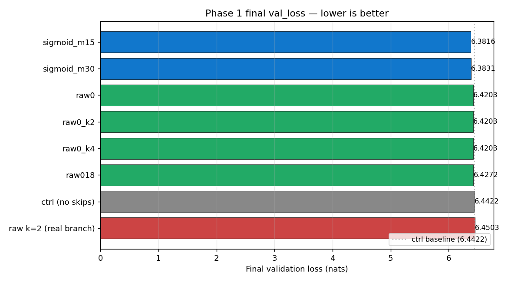

# Bridge Early Layers to Late Layers to Improve Your LLM Training: U-Net Skips

By Vuk Rosić

U-Net skips connect the early layers of a transformer straight to its late layers, so the model can reuse early features deep in the stack.



This gives the late layers a shortcut back to the simple, local information the early layers saw.

It also gives gradients a shorter path to the early layers, which helps deep models train.

The whole thing is a handful of learned numbers, and it can start as almost a no-op.

## How it works, step by step

A deep transformer processes tokens one layer at a time, and each layer only reads the layer right below it.

Early layers tend to capture simple, local patterns, like which token is next to which.

By the time information reaches the late layers, those early details can get washed out.

A U-Net skip fixes this by saving the output of each early layer and adding it back into a matching late layer.

The pairing is symmetric, like the two sides of a letter U: the first layer connects to the last, the second to the second-to-last, and so on.

```text
layer 0  ->  layer 7
layer 1  ->  layer 6
layer 2  ->  layer 5
layer 3  ->  layer 4
```

Each bridge is gated, so the model decides how much of the early output to pull in.

The gate runs through a sigmoid, which keeps its strength between 0 and 1 and stable to train.



The gate weight starts at -1.5, so `sigmoid(-1.5)` is about 0.18, small but not zero.

A small nonzero start matters: a gate that starts at exactly zero gets almost no gradient and can fail to ever turn on.

So the skip begins faint, and training raises or lowers it per dimension as the model learns how useful the bridge is.

## In code

Keep one gate vector per bridge, initialized to -1.5.

```python
# n_skips bridges, one gate value per embedding dimension
gate = nn.Parameter(torch.full((n_skips, d_model), -1.5))
# sigmoid(-1.5) ~ 0.18  ->  the skip starts small but nonzero
```

In the first half of the layers, save each layer's output.

```python
skips = []
for i, block in enumerate(blocks):
    x = block(x)
    if i < n_skips:
        skips.append(x)        # remember early outputs
```

In the second half, before each layer, add its matching early output through the sigmoid gate.

```python
for i, block in enumerate(blocks):
    if i >= n_layers - n_skips:
        j = n_layers - 1 - i               # matching early layer
        x = x + torch.sigmoid(gate[j]) * skips[j]
    x = block(x)
```

Put together, the first half writes its outputs and the second half reads them back, scaled by a learned per-dimension gate.

This is the same skip pattern used in the record-setting nanoGPT speedrun, where the sigmoid gate and the small nonzero start are what make it train well.

## Phase 1 ablation — does the bound help, and does skip count matter?

Eight runs on a `tiny1m` (12 layers, d_model 64, body ~542K params, total ~1M) trained for 733 steps (~3M tokens) on `processed_data/speedrun_40M`, all with seed 42.

### Runs

| run | use_unet_skips | gate_type | gate_init | skip_count | val_loss | val_ppl |
|---|---|---|---|---|---|---|
| `tiny_unet_ctrl` | false | — | — | 0 | 6.4422 | 627.78 |
| `tiny_unet_raw0_k2_real` | true | raw | 0.0 | **2** | 6.4503 | 632.90 |
| `tiny_unet_raw0` | true | raw | 0.0 | 6 (default) | 6.4203 | 614.20 |
| `tiny_unet_raw018` | true | raw | 0.18 | 6 (default) | 6.4272 | 618.43 |
| `tiny_unet_sigmoid_m15` | true | sigmoid | −1.5 | 6 (default) | **6.3816** | **590.85** |
| `tiny_unet_sigmoid_m30` | true | sigmoid | −3.0 | 6 (default) | 6.3831 | 591.77 |




### What the data shows

1. **The sigmoid bound beats raw scalar gates by 0.04–0.07 val_loss.** The best run (`sigmoid_m15`, 6.3816) is 0.039 below the best raw run and 0.061 below the no-skip control. The benefit is robust to the initial value: `sigmoid_m15` and `sigmoid_m30` differ by only 0.0015 val_loss, well inside run-to-run noise.

2. **The sigmoid advantage comes from the [0, 1] bound, not the start point.** `sigmoid(-1.5) ≈ 0.18` — the same effective skip weight as `raw_init=0.18` at initialization. The two runs start with identical skip signal strength, but sigmoid ends 0.046 val_loss better. The bound prevents the gate from drifting to large values that would let the skip dominate the residual stream.


3. **Skip count is non-monotonic for raw gates.** With raw gates at init 0, k=2 (only the deepest two bridges) is *worse* than no skips at all, but k=6 (the full U) is *better* than no skips. The model apparently needs a minimum bridge count to overcome the dead-start of raw gates at 0; fewer than that minimum is a net loss.


### Caveats

- The skip_count sweep is incomplete. Of the original 8 runs, only `raw0_k2_real` actually used a non-default `skip_count` — the `raw0`, `raw0_k2`, and `raw0_k4` names were cosmetic; the launch script never passed `--unet_skip_count` for those three, so all three used the default k=6 and produced bit-identical val_loss curves. A re-run with the flag actually passed is needed to map out k=1, 2, 4, 5 for both families. See `scripts/kaggle_unet_phase1_redo.sh`.

- The `raw0_k2_real` run used a different code path from the others (this is the "real" branch referenced in the original `train_llm.py` history). Whether the k=2 dip is a property of the architecture or an artifact of that branch is unresolved.

- All runs are tiny1m at 3M tokens. Scaling up is the obvious next test — if the sigmoid-vs-raw gap holds or grows at a 5–10M model, the bound is doing real work and not just a small-model artifact.
