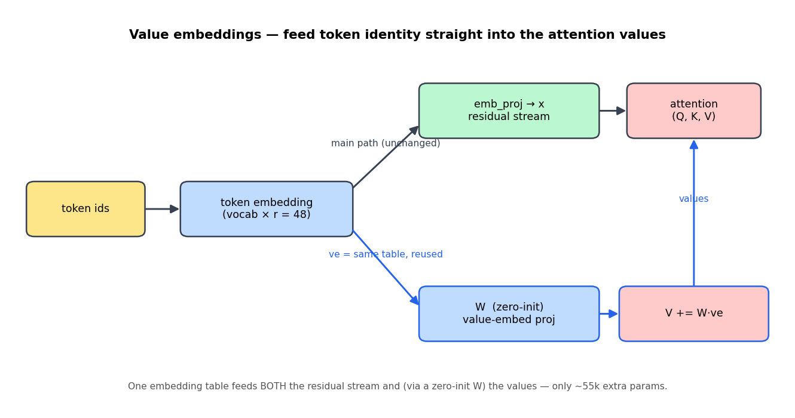
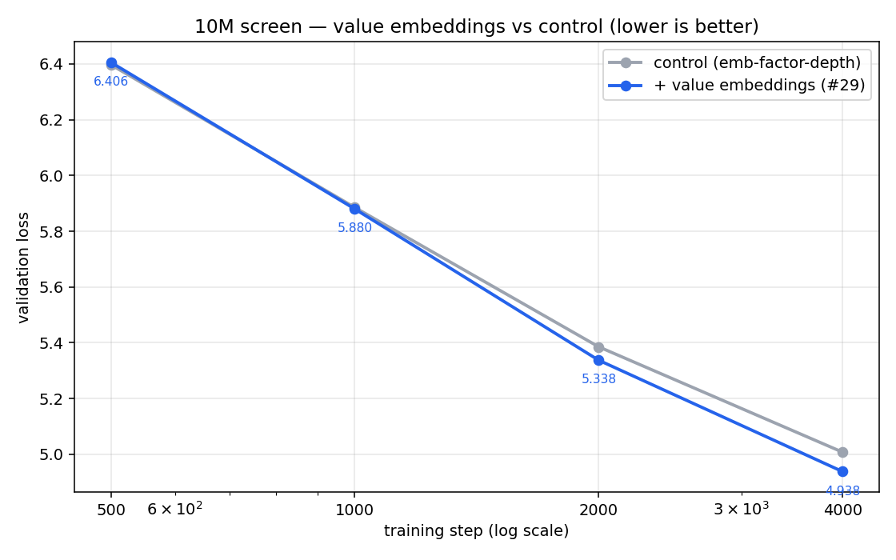
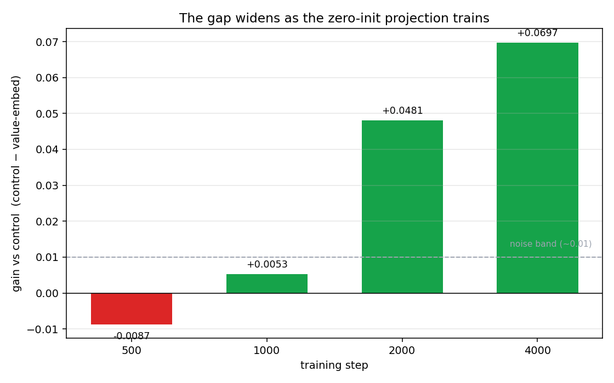

# Value Embeddings: a +0.07 win on a 10M model (`#29`)

**Result:** adding *value embeddings* to the 10M model beat the standing
champion by **+0.069 validation loss** at the 4,000-step screen — the first
architecture lever in this series that cleared the noise band by a wide margin,
and the gap was **still widening** when we stopped.

This is the companion write-up for the YouTube ablation series. It covers what we
changed, why, and how to read the result honestly.

---

## 1. The setup: when every trick lands in the noise

Before this, we screened five "residual-control" tricks — embed-residual,
zero-init-resid, attention-output-gate, LayerScale, SmearGate. Every one of them
landed inside **±0.01 val loss** of the control. At a loss of ~5.0 that's ~1%
perplexity — indistinguishable from just changing the random seed.

The reason they all looked the same: they were all **the same lever**. Each one
just *rescales the residual stream* — a small volume knob on what's already
flowing through the network.

> When a whole *family* of tweaks lands in the noise, the move isn't to keep
> tuning the knob. It's to **change levers**.

So we went looking for a lever that does something structurally different.

---

## 2. What value embeddings are

A normal transformer only sees a token's identity once — at the very bottom,
where the embedding enters the residual stream. After that, every layer works on
a *mixed* representation. The raw "which token is this" signal gets diluted with
depth.

**Value embeddings** re-inject that raw token identity directly into the
attention **values** at every layer:



The same token-embedding table feeds two paths now:

- the **main path** (unchanged): embedding → residual stream → transformer
- a **new path** (blue): embedding → small projection `W` → *added to the
  attention values* `V`

So attention can pull on the literal token identity at any depth, not just the
blended residual. This idea comes from the
[modded-nanogpt speedrun](https://github.com/KellerJordan/modded-nanogpt)
(leaderboard records 55 / 63); we adapted it to fit a param-golf budget.

---

## 3. The implementation — three decisions that matter

The whole change is ~15 lines. Three choices made it cheap *and* a clean
experiment.

**a) Reuse the factorized embedding as the source.** Our 10M model already
factorizes the embedding into a tiny `vocab × 48` table. We feed *that* same
table into the value path instead of adding a new full-size one. Cost: one
`48 × kv_size` projection per layer ≈ **55k params total (+0.7%)** — stays in
budget.

**b) Inject into the values.** Inside attention, after computing `V`:

```python
# models/layers.py — MultiHeadAttention.forward
if self.use_value_embed and ve is not None:
    V = V + F.linear(ve, self.value_embed_proj)   # ve = reused token embedding
```

**c) Zero-init the projection `W`.** This is the subtle one. `W` starts at all
zeros, so:

- **Step 0 is an exact baseline** — the model is bit-for-bit identical to control,
  so the screen measures *the mechanism*, not a lucky re-seed.
- It **trains from step 1 anyway** — a zero weight still gets a nonzero gradient,
  so the value path grows as soon as it helps.
- Using a raw `Parameter(torch.zeros(...))` (not an `nn.Linear`) means it draws
  **no random numbers at init**, so every *other* weight stays identical to
  control too.

We verified all three locally before spending a single GPU-minute: identical
logits at init, nonzero gradient on `W`, +55k params.

---

## 4. The result

Same schedule as the champion, stopped at step 4,000 (the "screen" point),
`seed=42`:



The two curves are glued together early, then value embeddings peel away and
finish clearly lower. The story is even clearer if you plot the **gap**:



| Step | Value-embed | Control | Δ (control − ve) |
|---|---|---|---|
| 500  | 6.4059 | 6.3972 | **−0.0087** |
| 1000 | 5.8800 | 5.8853 | +0.0053 |
| 2000 | 5.3375 | 5.3856 | +0.0481 |
| 4000 | **4.9381** | 5.0078 | **+0.0697** |

Read the shape, not just the endpoint: **−0.009 → +0.005 → +0.048 → +0.069.**

That ramp is the zero-init `W` doing its job. Early on `W` is still near zero, so
the value path contributes almost nothing and the curves match (it's even
slightly *behind* at step 500 — the extra parameter adds a touch of early
wobble). As `W` trains, the value path turns on and the gap opens up — and it
hadn't plateaued when we hit the gate.

For scale: the best residual-rescale lever (LayerScale) topped out at **+0.0106**.
Value embeddings hit **+0.0697** — about **7× larger**, and ~7× the noise band.

---

## 5. Honest caveats (how *not* to overclaim)

- **This is a screen, not the record.** 4,000 steps is the cheap filter — the
  established 10M champion is measured at the full 200M-token endpoint
  (val 4.3011). The current work focused on screening, not on chasing the
  full-length champion, so this is the new **screen leader**, not the crowned
  champion.
- **One seed.** The margin is far outside the noise band, so we trust the
  *direction*. The exact number at the 4,000-step mark is what this screen
  establishes; we are not running it to the 200M-token endpoint in this work.
- Because the gap was still widening at the gate (Δ went 0.009 → 0.005 →
  0.048 → 0.069 across 500/1k/2k/4k), it's plausible a longer run would
  *increase* the lead — but we are not claiming that.

---

## 6. The lesson

The headline isn't "value embeddings are great." It's the screening discipline:

1. Start from a clear failure mode — *or a clearly different lever*.
2. Make the change zero-init / baseline-equivalent, so step 0 == control and the
   screen isolates the mechanism, not a re-seed.
3. Compare against fixed control checkpoints.
4. Kill ideas when the curve stops supporting the story — and **promote the rare
   one that clears the noise band by a wide margin.**

Five tricks in the noise told us to stop tuning the residual knob. The sixth,
pulling a different lever, was the one that moved.

---

## Reproduce

```bash
# the screen (this result), ~30 min on a small GPU:
python train_llm.py --config 10m --stop_at_step 4000 --use_value_embed true --seed 42

# regenerate the figures in this folder:
python docs/tutorials/value_embeddings/make_figures.py
```

Code: [models/layers.py](../../../models/layers.py) (`MultiHeadAttention`),
[models/llm.py](../../../models/llm.py) (value-embed source),
flag `use_value_embed` in [configs/llm_config.py](../../../configs/llm_config.py).
Full ablation log: [youtube-architecture-ablation-log.md](../../youtube-architecture-ablation-log.md) §8.
