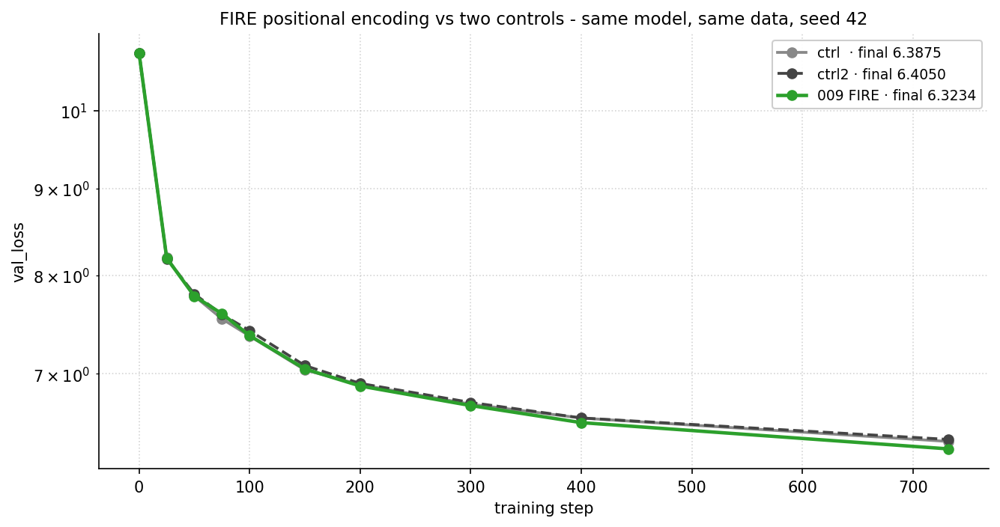

# FIRE 位置编码：一个小小的可学习偏置，让我们的 LLM 损失变小了

Vuk Rosić

我们把这个小技巧加进了一个小语言模型，验证集损失改善了：



语言模型读句子的时候，每个词都会回头看它前面所有的词，然后决定每个词有多重要。

那个"有多重要"就是一个数字，叫做注意力分数。分数越大，就越关注那个词。

但是光看分数没法知道一个词在*哪里*。"狗咬人"和"人咬狗"看起来会一样。

位置编码就是来修这个问题的：它告诉模型每个词在句子里的位置。

大多数模型用一套写死的数学公式来做这件事，每个文本都用同一个公式，永远不变。

FIRE 是用学习的方式：模型给每个注意力分数加一个小小的、可学习的数字，然后在训练中慢慢调整它。

为什么学习比写死更好呢？写死的规则对同样距离的词一视同仁。学出来的规则能发现你的数据真正需要什么。

而且没有坏处：如果写死的规则本来就完美，模型会自然学到和它一样的结果。

## 第一个概念：距离越远，影响越小

FIRE 有一个常识作为起点：靠得近的词通常互相有关联，靠得远的词通常关系更小。

所以它加的那个额外数字，会随着两个词的距离变远而变小。

这条规则就是一条简单的从 1 到 0 的斜坡。


这条斜坡是固定的，不参与学习。

为什么要保留一个固定的部分呢？它能保证模型在任何距离上都有合理的行为，哪怕训练中很少见到的距离也没问题。

学习是发生在这个稳妥的默认值之上的。

## 第二个概念：有些词更重要

光有斜坡对所有词一视同仁。一个逗号和一个段落分隔符会以同样的速度衰减。

但其实不应该这样。一个段落分隔符会改变后面所有内容的意思，所以即使隔得很远，后面的词也应该注意到它。

FIRE 的处理办法是让每个词自己可以调高或调低它自己的那个数字。

模型从数据里学到哪些词值得被加强。没人告诉它该挑哪些。


左边：固定斜坡，对所有输入都一样。

右边：学完之后，几个重要的词亮起来变成一列一列的，意味着后面所有词都会多关注它们。

## 一开始它什么也不做

可学习的那部分一开始正好是 0。

所以在训练的第一步，模型表现得和没有加 FIRE 的模型一模一样，没有任何变化。

如果这些额外的数字有用，训练会慢慢把它们调大。如果没用，它们就一直是 0。

这就是为什么这个技巧可以放心用在任何模型上：它不会让起点变差。

## 整个技巧的代码

在真实的代码库里大概 50 行，核心就是这一段：

```python
gamma = (1 - distances / d_max).clamp(min=0)        # 固定斜坡 [T, T]
score = content_proj(x) @ w                          # 可学习，初始为 0
bias  = gamma * (score_t[:, :, None] + score_s[:, None, :])

attn_scores = q @ k.transpose(-1, -2) / sqrt(d_k) + bias
```

一条固定斜坡，每个词一个微小的可学习分数，相乘之后加到注意力分数上。

论文：Li 等，《Functional Interpolation for Relative Position Encoding》（arXiv:2310.04418v2）。

---

### 想在 1 小时内得到类似的结果？和我一对一通话聊聊

📆 **创始用户专享 $20（8 折）– 仅限前 8 个名额。**
→ https://cal.com/vuk-ai/60-min

我们也可以一起聊你卡住的地方，比如选方向、第一个实验、一篇啃不动的论文、训练环境搭建，或者职业规划。

### 还不想通话？先免费加入 Skool 社群

我每发一个实验都会配上框架代码和一步步的流程指引，让你可以自己复现，然后再跑你自己的变体。你还能收到每周的研究通讯，和一群认真做 AI 研究的人一起交流。
免费试用。
→ https://www.skool.com/become-ai-researcher-2669/about
